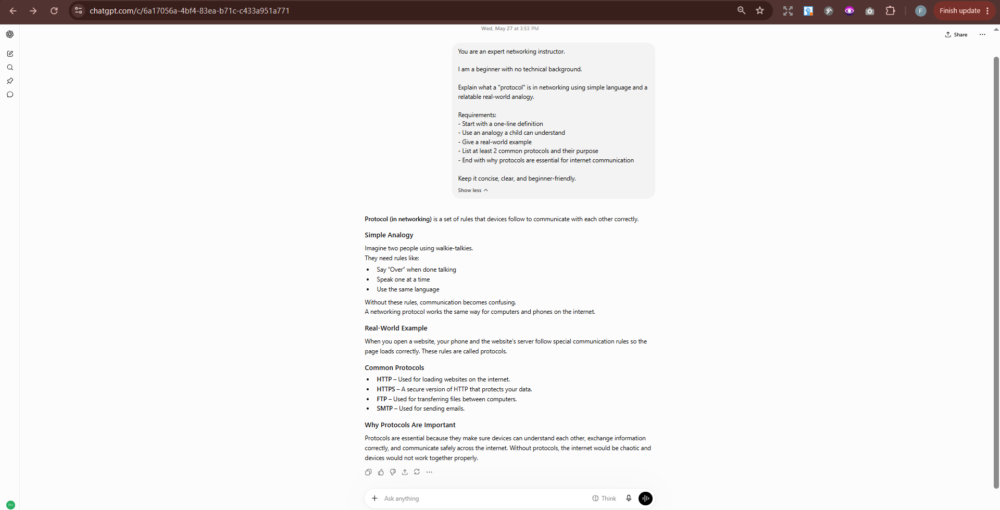
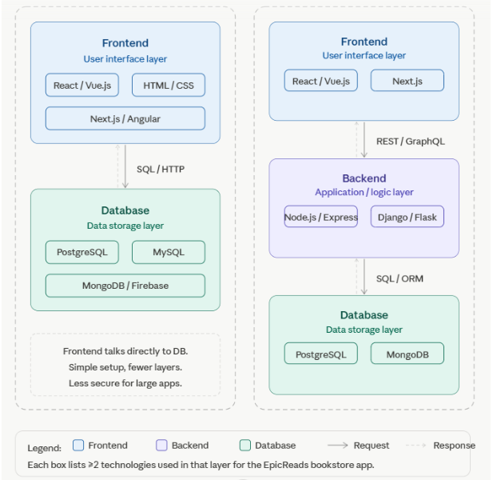
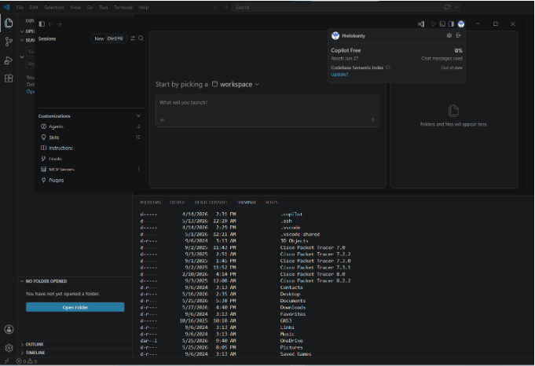

# Week 00 - Internet and Networking

Part of the DevOps Micro Internship (DMI) Cohort 3 with Agentic AI

---

# 🧑‍💻 Task 1: Using ChatGPT as Your Learning Assistant

## Scenario

You're new to DevOps and will frequently encounter technical questions. ChatGPT can be your learning companion.

## Your Task

Write a clear ChatGPT prompt to help you understand:

> "What is a protocol in networking? Explain with a simple real-life example."

Take a screenshot of your interaction showing:

* Your detailed prompt (with clear expectations)
* ChatGPT's simplified response with an example

## Screenshot

Save your screenshot in the `screenshots` folder and update the file name below.




---

## What I Learned (2–3 lines)

### **Lesson Learned**

I learnt that A protocol is simply a set of rules that helps devices communicate correctly, just like people need rules to have a clear conversation. Different protocols have different jobs (such as loading websites, sending emails, or transferring files), and they are essential because they allow the internet to work smoothly, accurately, and securely.


---

# 🌐 Task 2: Internet and Networking

## Scenario

Your friend is launching an online bookstore named **EpicReads**.

He asked you to explain how users globally can access his website hosted in Finland.

## Your Task

Write a short explanation (**100–150 words**) that includes:

* Packet Switching
* IP Address
* TCP/IP
* HTTP/HTTPS

💡 **Tip:** You may use ChatGPT (as demonstrated in Task 1) to refine your explanation.

## Answer

When a user tries to access EpicReads from anywhere in the world, the internet helps deliver the website using several technologies. 

First, every device has an IP address, which works like a home address to identify it on the network. When a user enters the website URL, the request is sent using HTTP or HTTPS protocols, which define how data is transferred securely between the browser and the server.

The data is broken into small pieces called packets through a process known as packet switching. These packets travel across different routes on the internet to reach the server in Finland.

TCP/IP ensures that all packets are delivered correctly and reassembled in the right order. This process allows users worldwide to access the website quickly and reliably.


---

# 🏗️ Task 3: Application Architecture & Stack

## Scenario

EpicReads bookstore has two application versions:

### Two-Tier Application

* Frontend
* Database

### Three-Tier Application

* Frontend
* Backend
* Database

## Your Task

* Draw simple diagrams (hand-drawn or tool-based such as draw.io)
* Label each layer clearly
* List at least two common technologies or tools used for each layer
* Submit a screenshot or photo clearly showing your own drawing

## Diagram Screenshot / Photo

Save your diagram image in the `screenshots` folder and update the file name below.




---

## Technologies Used

### Frontend

React / Vue.js
Next.js

### Backend

Node.js / Express
Django / Flask

### Database

PostgreSQL
MongoDB

---

# 🌍 Task 4: Domain Name & DNS (Basic Concepts)

## Scenario

Your friend's bookstore **EpicReads** is currently accessible through:

```text
52.172.142.222:3000
```

He purchased the domain:

```text
epicreads.com
```

## Your Task

In **50–100 words**, explain in your own words:

1. What is DNS (Domain Name System)?
2. Which DNS record type should be used to connect the domain to the given IP, and why?

## Answer

DNS (Domain Name System) is a system that converts human-readable domain names like epicreads.com into IP addresses such as 52.172.142.222 so browsers can locate websites on the internet. Without DNS, users would need to remember IP addresses to access websites.
The DNS record type used to connect the domain to the IP address is an A Record. An A Record links a domain name directly to an IPv4 address, allowing users to access the website using the domain instead of the server IP and port number.

---

# 💻 Task 5: Visual Studio Code Setup (Hands-on)

## Your Task

Install Visual Studio Code (if not already installed).

Take a screenshot of your VS Code environment showing:

* Terminal open inside VS Code
* Running a basic command:

### Windows

```powershell
dir
```

### Linux / macOS

```bash
pwd
ls
```

* Your selected VS Code theme clearly visible

⚠️ **Important:** The screenshot must show your username or another identifiable detail to confirm it is your environment.

## Screenshot

Save your screenshot in the `screenshots` folder and update the file name below.



---

# 🔗 Task 6: Publish Your Assignment as a LinkedIn Post

## Objective

Publishing on LinkedIn helps you:

* Build your professional online presence
* Reinforce your learning
* Document your DevOps journey publicly

## Your Task

Summarize your answers from Tasks 1–5 into a LinkedIn post.

Clearly structure your post into the following sections:

* ChatGPT
* Internet & Networking
* App Architecture
* DNS
* VS Code Setup

Add the following credit note at the end of your post:

> **P.S. This post is part of the DevOps Micro Internship (DMI) with Agentic AI — Cohort 3 — by Pravin Mishra. My graded progress is public: https://dmi.pravinmishra.com/s/YOUR-GITHUB-USERNAME.html · Start your DevOps journey: https://dmi.pravinmishra.com/?utm_source=student&utm_medium=ps-linkedin&utm_campaign=cohort3**

---

## LinkedIn Post URL

Paste your LinkedIn post URL here:

```text
https://www.linkedin.com/posts/aamicheal_pravin-mishra-the-cloudadvisory-linkedin-activity-7465432241356300289-hFdP?utm_source=share&utm_medium=member_desktop&rcm=ACoAADFvgDYBsnsyE66xAyq2HzH3Jfsf19WE6JA
```

---

## LinkedIn Post Backup Copy

Paste the full text of your LinkedIn post here:

My Week 0 Journey in the DevOps Micro Internship
I’m excited to share that I’ve successfully completed Week 0 of the DevOps Micro Internship led by Pravin Mishra. This first phase of the internship introduced me to several core concepts that form the foundation of DevOps and modern software systems.

🔹 ChatGPT as a Learning Assistant
I learned how to effectively use ChatGPT to simplify technical concepts, assist with research, improve productivity, and support problem-solving during learning and development tasks.
🔹 Internet & Networking Fundamentals
I explored how the internet works and gained a better understanding of networking protocol concepts such as IP addresses, DNS, TCP/IP, and HTTPS. I also learned how users around the world communicate with web servers and access websites securely.
🔹 Application Architecture & Technology Stack
I studied the difference between two-tier and three-tier application architectures and understood how the frontend, backend, and database layers interact with each other in real-world applications. 
🔹 Domain Name System (DNS)
I learned how DNS translates human-readable domain names into IP addresses and understood the role of DNS records such as A Records in connecting domains to servers.
🔹 Visual Studio Code Setup
I successfully configured Visual Studio Code, customized the development environment, opened the integrated terminal, and executed basic system commands as part of my setup for future DevOps hands-on activities.

This week has given me a strong foundation in DevOps basics, technical research, development tools, and networking concepts. I’m excited to continue learning, building projects, and improving my practical DevOps skills throughout this internship journey.

P.S. This post is part of the DevOps Micro Internship (DMI) Cohort 3 run by Pravin Mishra. You can be part of this learning community too. 
JOIN HERE (https://lnkd.in/dF6fpQdt ) DMI Cohort 3: https://lnkd.in/d5BvQjta
Pravin Mishra Profile: https://lnkd.in/dxxNG6hH

---

# Reflection – Week 0

### What did you find easy?

I found it easy to understand the basic concepts of DevOps, application architecture, and networking because they were explained in a structured way. Setting up Visual Studio Code and using ChatGPT as a learning assistant also helped me complete the activities more efficiently.

---

### What was difficult?

The most challenging part was understanding how different networking components, such as DNS, IP addresses, TCP/IP, and HTTPS, work together behind the scenes to deliver a website. It required extra reading and practice to fully understand the overall flow.

---

### What will you improve next week?

Next week, I will spend more time practicing the concepts through hands-on exercises instead of only reading about them. I also plan to improve my command-line skills, become more comfortable using development tools, and strengthen my understanding of DevOps fundamentals as I prepare for more advanced tasks.

---

## 📌 About DMI & CloudAdvisory

DevOps Micro Internship (DMI) is a project-based DevOps program run by Pravin Mishra (The CloudAdvisory) focused on real-world execution, systems thinking, and career readiness.

It helps learners build strong DevOps foundations with hands-on experience.


## 📌 Resources

- 🌐 **DMI Official Website:** https://pravinmishra.com/dmi  
- 🎓 **DevOps for Beginners (Udemy):** https://www.udemy.com/course/devops-for-beginners-docker-k8s-cloud-cicd-4-projects/  
- 🎓 **Ultimate Agentic AI DevOps with Clude Code** https://www.udemy.com/course/ultimate-agentic-ai-devops-with-claude-code/?referralCode=448389767BC96284087B
- 🎓 **DevOps with Claude Code: Terraform, EKS, ArgoCD & Helm** https://www.udemy.com/course/devops-with-claude-code-terraform-eks-argocd-helm/?referralCode=1C5B734505D65A010FA3
- ▶️ **YouTube Playlist (DMI Cohort 3):** https://www.youtube.com/playlist?list=PLFeSNDtI4Cho  
- 🔗 **Pravin Mishra (LinkedIn):** https://www.linkedin.com/in/pravin-mishra-aws-trainer/  
- 🏢 **CloudAdvisory (LinkedIn):** https://www.linkedin.com/company/thecloudadvisory/

---

*This submission is part of DevOps Micro Internship (DMI) Cohort 3 — Agentic AI Track*