# Assignment 3 — Production Maintenance Drill (OPS Checklist)

Part of the DevOps Micro Internship (DMI) Cohort 3 with Agentic AI

---

## Purpose

In this assignment, you will treat your already deployed React application (on Ubuntu VM with Nginx) as a live production system. You will perform structured operational checks covering network validation, service health, log analysis, resource monitoring, configuration verification, and incident simulation with recovery — mirroring real on-call DevOps responsibilities.

---

# Task 1 — Server Access & Networking Validation

## Goal

Verify that the deployed React application is reachable from the browser and confirm basic network connectivity of the Ubuntu VM.

### Evidence

#### Screenshot 1 — Browser showing the React app with your Full Name visible on the UI

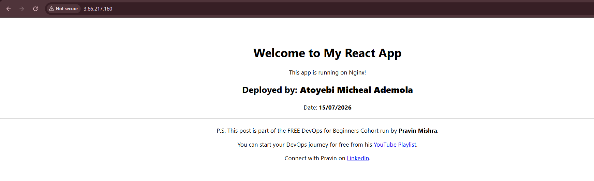

---

#### Screenshot 2 — Output of `ip a`

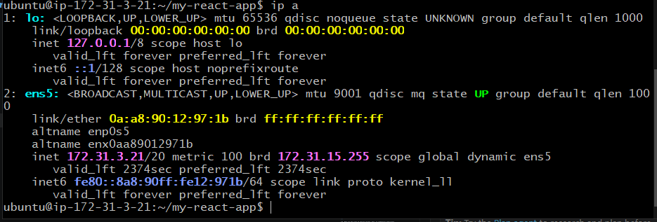

---

#### Screenshot 3 — Output of `sudo ss -tulpen`

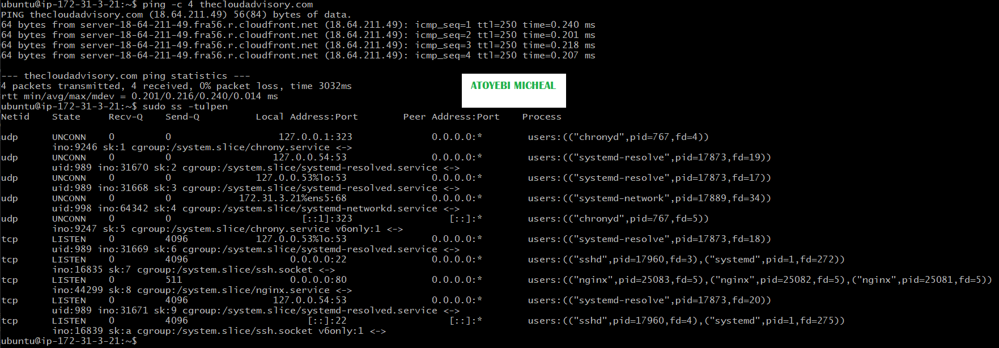

---

#### Screenshot 4 — Output of `sudo ufw status`

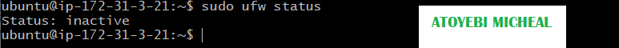

---

### Notes

Answer the following in your own words:

**1. What proves Nginx is listening on 0.0.0.0:80?**

In the sudo ss -tulpen output, it shows the line tcp listen 0.0.0.0:00, nginx confirm this as the 0.0.0.0 means nginx is bound to all network interfaces not just localhost, it also accepts HTTP connections from any ip address.

---

**2. What proves SSH is active on port 22?**

The sudo ss -tulpen output also shows tcp listen 0.0.0.0.22 .... sshd which confirm the ssh deamon (sshd) is actively listening to port 22 across all interfaces.

---

**3. Did you find any unexpected open ports? Explain briefly.**

No, there were no unexpected open ports. Only standard ports like nginx (port 80) and 22 (SSH) were open, which are required for remote access and are expected on a server.

---

# Task 2 — Service Health & Systemd Validation (Nginx)

## Goal

Verify that Nginx is properly installed, running, enabled at boot, and safely configured.

### Evidence

#### Screenshot 1 — Output of `systemctl status nginx --no-pager`

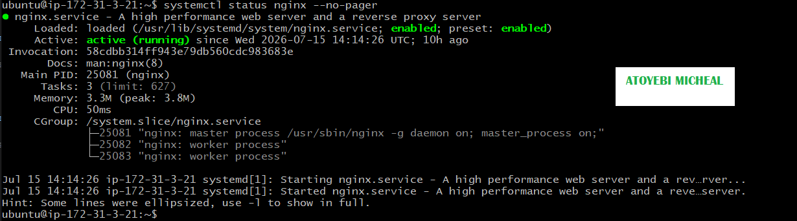

---

#### Screenshot 2 — Output of `sudo nginx -t`

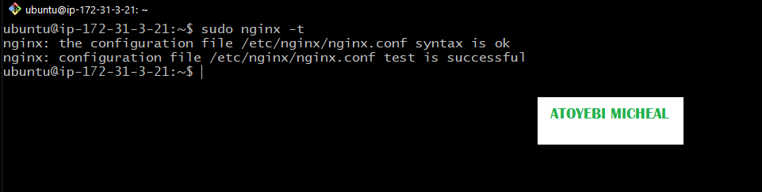

---

#### Screenshot 3 — Output of `sudo ss -lptn '( sport = :80 )'`

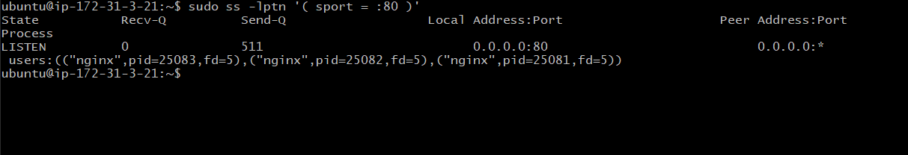

---

### Notes

Answer the following in your own words:

**1. What happens if Nginx fails to restart in production?**

If Nginx fails to restart in production, the web server becomes unavailable, which means users cannot access the website or application. This can lead to downtime, failed requests (such as 502/503 errors), loss of user trust, and potential business impact.

---

**2. What's your basic rollback plan?**

My basic rollback plan includes:

Revert configuration changes
Restore the last known working Nginx configuration (from backup or version control).

Test configuration
Run: "nginx -t"

To ensure there are no syntax errors.

Restart Nginx with "sudo systemctl restart nginx"

Verify service status with "sudo systemctl status nginx"

---

# Task 3 — Logs & Request Trace

## Goal

Verify real traffic flow and analyze logs to understand system behavior and errors.

### Evidence

#### Screenshot 1 — Output of `sudo tail -n 30 /var/log/nginx/access.log`

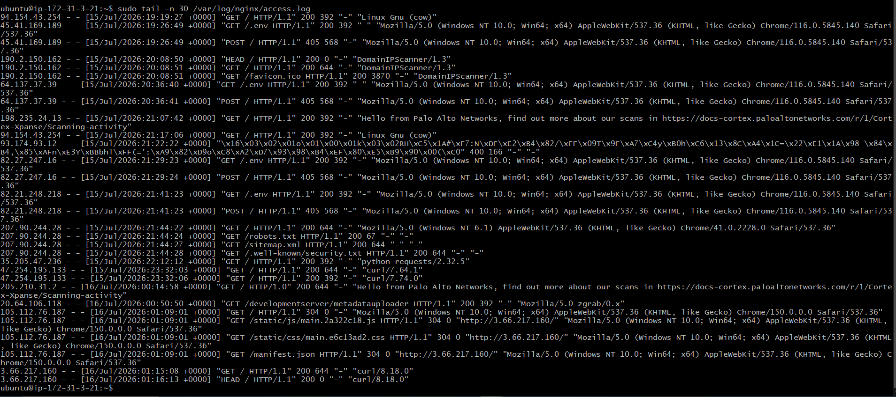

---

#### Screenshot 2 — Output of `sudo tail -n 30 /var/log/nginx/error.log`

---

#### Screenshot 3 — Output of `sudo journalctl -u nginx --no-pager -n 50`

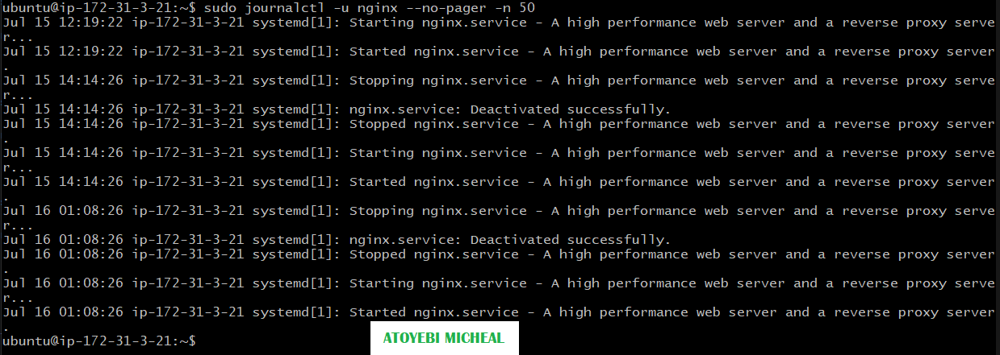

---

### Notes

Answer the following in your own words:

**1. Were there any errors in the logs?**

- If yes, mention 1–2 example error lines from the logs and explain what each one means in simple terms.
- If no, explain what it means if the error log is empty or shows no recent errors during your check.

No, there were no errors found in the logs during the check. If the error log is empty or shows no recent errors, it means that the server is running smoothly and there are no critical issues with the configuration or request handling at that time.

---

**2. If there were no errors, what does that indicate about the system?**

It indicates that the system is stable and functioning correctly. Nginx is handling requests properly, and there are no failures such as crashes, misconfigurations, or failed connections.

---

**3. Based on the access logs, were your curl requests visible in the log entries? What does that prove about traffic flow?**

Yes, the curl requests were visible in the access logs.

This proves that:

Requests are successfully reaching the server ✅
Nginx is processing incoming traffic correctly ✅
Logging is properly configured and capturing client activity ✅

It confirms that the traffic flow from the client (curl) to the server is working as expected

---

# Task 4 — System Resource Health Check (Capacity Red Flags)

## Goal

Assess server capacity and detect potential performance or failure risks.

### Evidence

#### Screenshot 1 — Output of `uptime`

---

#### Screenshot 2 — Output of `free -h`

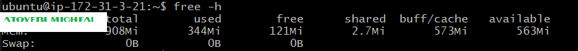

---

#### Screenshot 3 — Output of `df -h`

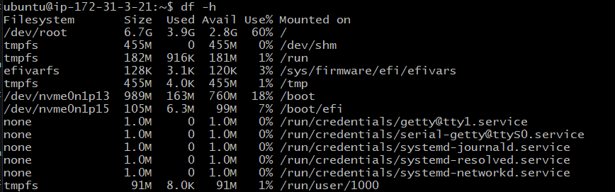

---

#### Screenshot 4 — Output of `sudo du -sh /var/* | sort -h`

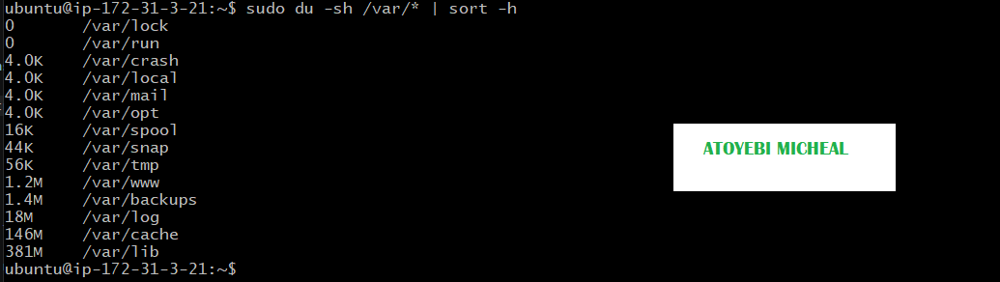

---

### Notes

Answer the following in your own words:

**1. Which resource looks most critical right now? (CPU/load, memory, or disk) Explain why.**

Disk usage appears most critical, as high utilization poses an immediate risk to system operations. A near-full disk can prevent logging, data writes, and normal application functionality.

---

**2. What happens if disk becomes 100% full in a production server?**

If disk usage reaches 100%, the system cannot write new data, causing application failures, logging issues, and potential service downtime.

---

# Task 5 — Configuration & Deployment Verification

## Goal

Ensure the correct React build is deployed and Nginx is serving it properly.

### Evidence

#### Screenshot 1 — Output of `ls -lah /var/www/html | head -n 20`

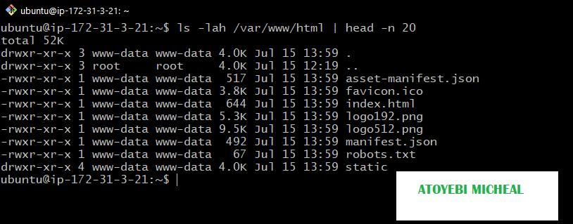

---

#### Screenshot 2 — Output of `grep -R "Deployed by" -n /var/www/html 2>/dev/null | head`

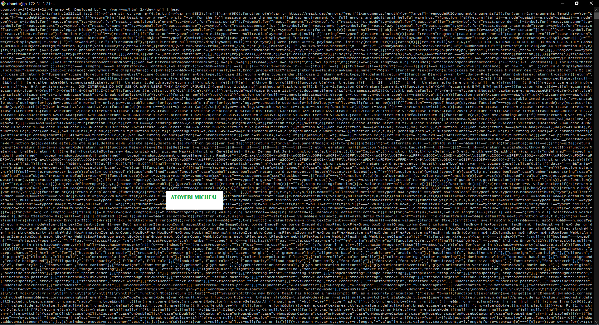

---

#### Screenshot 3 — Output of `grep -n "try_files" /etc/nginx/sites-available/default`

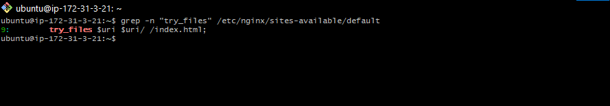

---

### Notes

Answer the following in your own words:

**1. How do you confirm that the correct version of the application is deployed?**

The correct version is confirmed by verifying deployment markers (e.g., a "Deployed by" string) within the build files in /var/www/html, along with checking file timestamps and contents. Additionally, validating the Nginx configuration (such as try_files) ensures the correct build is being served to users.

---

# Task 6 — Nginx Configuration Failure Simulation

## Goal

Simulate a real-world Nginx misconfiguration and recover the service safely.

### Evidence

#### Screenshot 1 — Output of `sudo nginx -t` showing the syntax error (broken config)

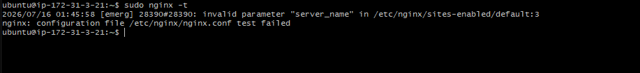

---

#### Screenshot 2 — Output of `sudo nginx -t` showing syntax ok (fixed config)

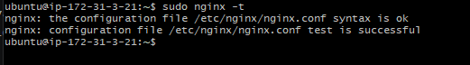

---

#### Screenshot 3 — Output of `curl -I http://<public-ip>` confirming recovery (200 OK)

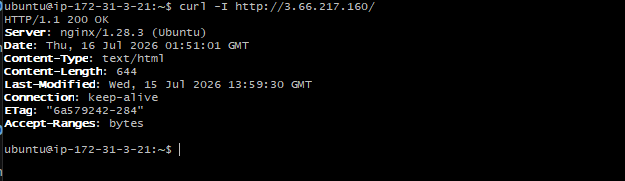

---

### Notes

Answer the following in your own words:

**1. What caused the configuration failure?**

The configuration failure was caused by a syntax error introduced while editing the Nginx configuration file. Specifically, a required semicolon (;) was removed, which made the configuration invalid.

---

**2. How did you fix the issue?**

The issue was fixed by correcting the syntax error in the configuration file (restoring the missing semicolon), then validating the configuration using:

---

**3. How can you avoid this kind of issue in real production systems?**

This can be avoided by validating configuration changes before applying them using nginx -t, following proper change management practices (such as version control and peer review), and testing updates in a staging environment before deploying to production.

---

# Task 7 — Web Application Failure Simulation

## Goal

Simulate missing deployment content and recover the application safely.

### Evidence

#### Screenshot 1 — Output of `curl -I http://<public-ip>` showing failure (non-200 response)

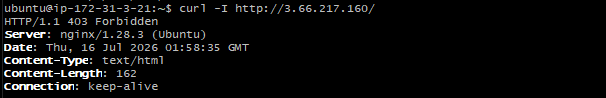

---

#### Screenshot 2 — Output of `curl -I http://<public-ip>` confirming recovery (200 OK)

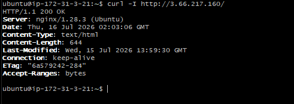

---

### Notes

Answer the following in your own words:

**1. What caused the application to break in this scenario?**

The application broke because the web root directory (/var/www/html) was removed/replaced with an empty directory, leaving Nginx with no content to serve. This resulted in a 403 Forbidden response.

---

**2. How did you fix the issue and restore the application?**

The issue was resolved by restoring the original web content directory from backup and restarting Nginx. After restoration, the server returned a 200 OK response, confirming normal operation.

---

**3. What steps would you take to prevent this kind of issue in real production systems?**

To prevent this, I would use proper deployment practices such as maintaining backups, using version control, restricting direct changes to production, and validating changes in a staging environment before deployment.

---

# Task 8 — Security & Reliability Review

## Goal

Review and reflect on the security and reliability practices applied during this assignment.

### Security & Reliability Notes

Answer the following in your own words:

**1. Why is SSH key-based authentication more secure than sharing passwords?**

SSH key-based authentication is more secure because it uses cryptographic keys instead of passwords, making it resistant to brute-force attacks and eliminating the risk of password sharing or reuse.

---

**2. Why should only required ports be open on a production server?**

Only required ports should be open to reduce the attack surface. Unnecessary open ports can expose services to unauthorized access and increase security risks.

---

**3. Why is it important for Nginx to be enabled on boot?**

Enabling Nginx on boot ensures the web server starts automatically after a reboot, maintaining service availability without manual intervention.

---

**4. What are the risks of sharing secrets, keys, or credentials publicly?**

Sharing sensitive information can lead to unauthorized access, data breaches, system compromise, and potential financial or reputational damage.

---

**5. Why should cloud resources be stopped or terminated when they are no longer needed?**

Stopping or terminating unused resources helps reduce costs, minimize security exposure, and prevent unnecessary resource consumption.

---

# LinkedIn Post (Required)

## Evidence

#### LinkedIn Post URL

Paste your LinkedIn post URL here:

`https://www.linkedin.com/posts/aamicheal_devops-linux-nginx-share-7483352187285282816-Shbx/?utm_source=share&utm_medium=member_desktop&rcm=ACoAADFvgDYBsnsyE66xAyq2HzH3Jfsf19WE6JA`

---

#### Screenshot — Published LinkedIn post

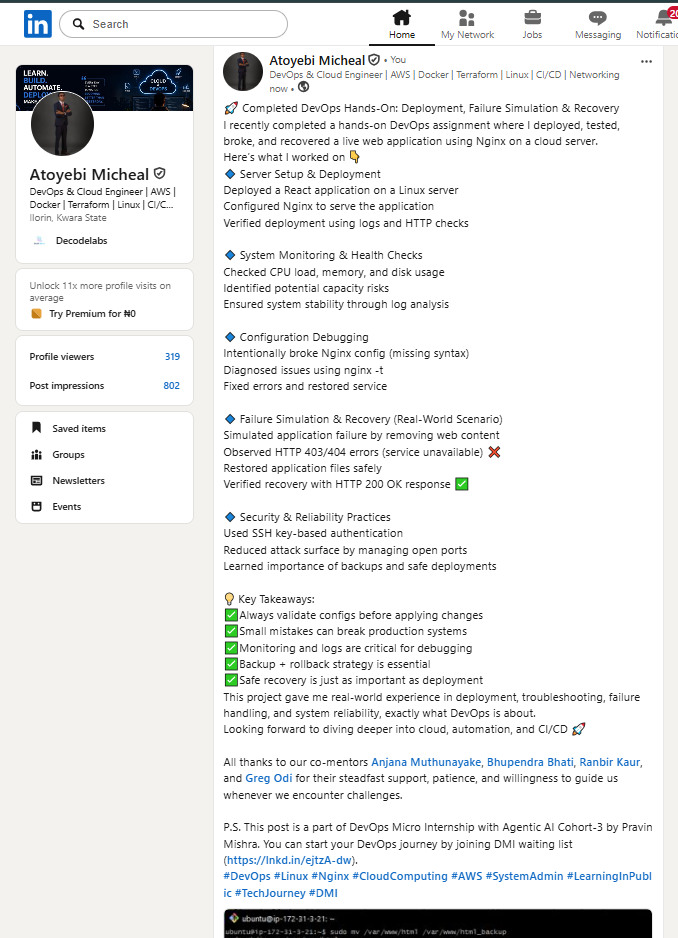

---

# Submission Instructions

- Add all required screenshots in your submission
- Full name must be visible in required screenshots
- Do not expose sensitive information (keys, passwords, account IDs)

---

# Completion Checklist

- [ ] Task 1: Screenshots (browser, ip a, ss -tulpen, ufw status) + Notes answered
- [ ] Task 2: Screenshots (nginx status, nginx -t, ss port 80) + Notes answered
- [ ] Task 3: Screenshots (access log, error log, journalctl) + Notes answered
- [ ] Task 4: Screenshots (uptime, free -h, df -h, du -sh) + Notes answered
- [ ] Task 5: Screenshots (ls html, grep deployed by, grep try_files) + Notes answered
- [ ] Task 6: Screenshots (nginx -t fail, nginx -t pass, curl recovery) + Notes answered
- [ ] Task 7: Screenshots (curl failure, curl recovery) + Notes answered
- [ ] Task 8: Security & Reliability Notes answered
- [ ] LinkedIn post published and URL submitted
- [ ] Full Name visible in all required screenshots
- [ ] No sensitive data exposed

---

## 📌 About DMI & CloudAdvisory

DevOps Micro Internship (DMI) is a project-based DevOps program run by Pravin Mishra (The CloudAdvisory) focused on real-world execution, systems thinking, and career readiness.

It helps learners build strong DevOps foundations with hands-on experience.

---

## 📌 Resources

- 🌐 DMI Official Website: https://pravinmishra.com/dmi  
- 🎓 DevOps for Beginners (Udemy): https://www.udemy.com/course/devops-for-beginners-docker-k8s-cloud-cicd-4-projects/  
- 🎓 Agentic AI DevOps with Claude Code: https://www.udemy.com/course/ultimate-agentic-ai-devops-with-claude-code/  
- 🎓 DevOps with Claude Code: Terraform, EKS, ArgoCD & Helm: https://www.udemy.com/course/devops-with-claude-code-terraform-eks-argocd-helm/  
- ▶️ YouTube Playlist: https://www.youtube.com/playlist?list=PLFeSNDtI4Cho  
- 🔗 Pravin Mishra (LinkedIn): https://www.linkedin.com/in/pravin-mishra-aws-trainer/  
- 🏢 CloudAdvisory (LinkedIn): https://www.linkedin.com/company/thecloudadvisory/

---

*This submission is part of DevOps Micro Internship (DMI) Cohort 3 — Agentic AI Track.*