# Assignment 5 — Bash Script Automation Drill (OPS Checklist)

Part of the DevOps Micro Internship (DMI) Cohort 3 with Agentic AI

---

## Purpose

In this assignment, you will practice Bash scripting by building a series of small automation scripts covering environment setup, variables, arrays, loops, file conditionals, if-else logic, and functions. These scripts form the foundation of real-world Linux automation used in DevOps, cloud, and production support environments.

---

# Task 1 — Bash Environment & Workspace Setup

## Goal

Verify that Bash is available on your system and create a clean workspace for this assignment.

### Evidence

#### Screenshot 1 — Output of `echo $SHELL` and `bash --version`

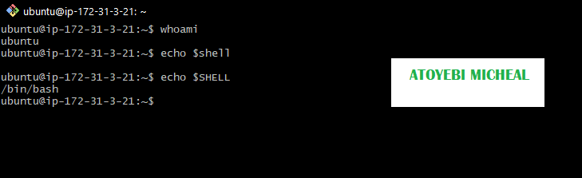

---

#### Screenshot 2 — Output of `pwd` and `ls -lah` showing the scripts directory

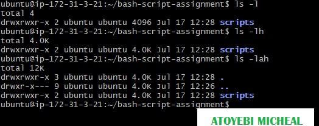

---

### Notes

Answer the following in your own words:

**1. What is Bash?**

Bash is a command-line interpreter that allows me to interact with the Linux system by typing commands. It is used to run commands, automate tasks, and write scripts that can execute multiple instructions at once.

---

**2. What is the difference between shell and Bash?**

A shell is a program that allows users to communicate with the operating system. Bash is a type of shell. In simple terms, Bash is just one of the many shells available, but it is the most commonly used one in Linux.

---

**3. Why is it important to confirm the Bash version before writing scripts?**

It is important to check the Bash version because some features and commands may not work in older versions. Knowing the version helps me avoid errors and ensures my script runs correctly on the system.

---

# Task 2 — Your First Bash Script

## Goal

Create your first Bash script, make it executable, and run it from the terminal.

### Evidence

#### Screenshot 1 — Content of `first-script.sh`

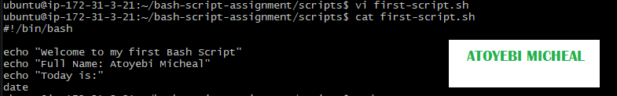

---

#### Screenshot 2 — Output of `./first-script.sh`

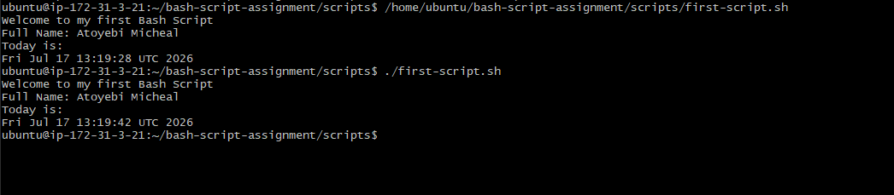

---

#### Screenshot 3 — Output of `ls -l first-script.sh` showing executable permission

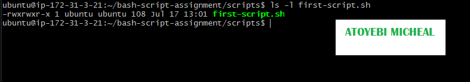

---

### Notes

Answer the following in your own words:

**1. What is the purpose of `#!/bin/bash`?**

The #!/bin/bash is used to tell the system that the script should be executed using the Bash shell. It ensures that the commands inside the script run with Bash and not another shell.

---

**2. Why do we use `chmod +x` before running a script?**

We use chmod +x to give the script execute permission. Without this permission, the system will not allow the script to run directly.

---

**3. What is the difference between running a script using `./script.sh` and `bash script.sh`?**

Running ./script.sh executes the script directly and requires execute permission. It also follows the shebang (#!/bin/bash). Running bash script.sh runs the script using Bash without needing execute permission and ignores the shebang.

---

# Task 3 — Variables: User Information Script

## Goal

Use variables to store and display user-related information.

### Evidence

#### Screenshot 1 — Content of `user-info.sh`

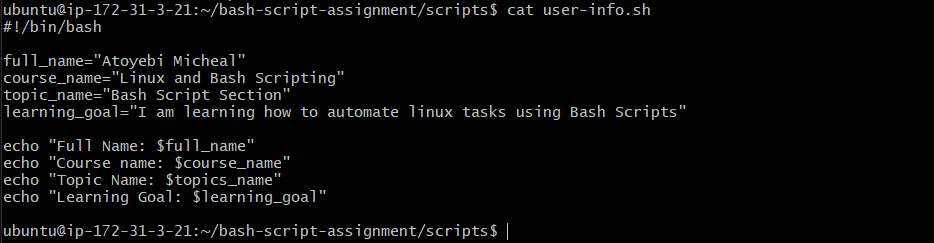

---

#### Screenshot 2 — Output of `./user-info.sh`

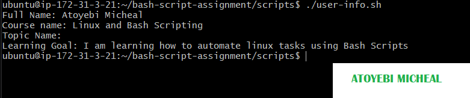

---

### Notes

Answer the following in your own words:

**1. What is a variable in Bash?**

A variable in Bash is a name used to store a value, such as text or numbers, so it can be reused later in a script.

---

**2. Why should we avoid spaces around the `=` sign when creating variables?**

We avoid spaces because Bash will not recognize it as a variable assignment. Adding spaces makes it look like a command instead, which causes an error.

---

**3. How do you access the value stored inside a Bash variable?**

You access the value of a variable by using the $ symbol before the variable name, for example $name.

---

# Task 4 — Arrays & Loops: Tools Checklist Script

## Goal

Use arrays and loops to print a checklist of tools used in Bash scripting.

### Evidence

#### Screenshot 1 — Content of `tools-checklist.sh`

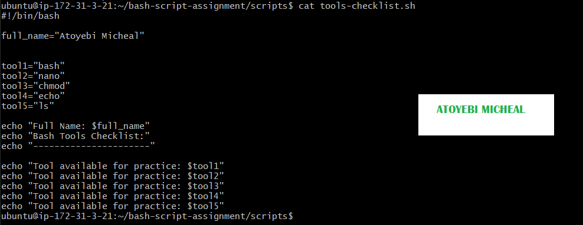

---

#### Screenshot 2 — Output of `./tools-checklist.sh`

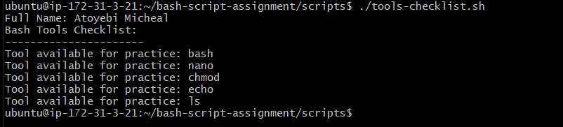

---

### Notes

Answer the following in your own words:

**1. What is an array in Bash?**

 An array in Bash is a variable that can store multiple values in a single name, instead of just one value.

---

**2. Why are arrays useful in scripts?**

 Arrays are useful because they allow you to store and manage multiple related items together, making scripts more organized and easier to loop through.

---

**3. What does `"${tools[@]}"` mean?**

 ${tools[@]} means all the elements stored in the tools array. It is used to access every value in the array, especially when looping through them.

---

**4. What is the purpose of the `for` loop in this script?**

The 'for' loop is used to go through each item in the array one by one and perform an action, such as printing each value.

---

# Task 5 — Loops: Number Counter Script

## Goal

Use loops to repeat a task multiple times.

### Evidence

#### Screenshot 1 — Content of `counter.sh`

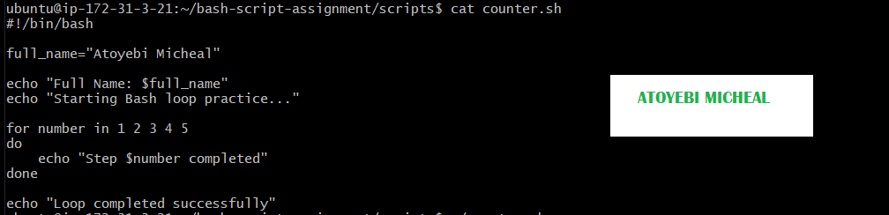

---

#### Screenshot 2 — Output of `./counter.sh`

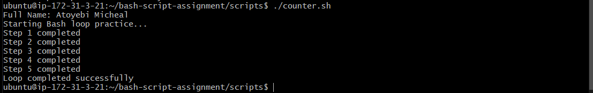

---

### Notes

Answer the following in your own words:

**1. What is a loop?**

A loop is a programming structure that repeats a set of commands multiple times until a condition is met.

---

**2. Why do we use loops in Bash scripting?**

We use loops to automate repetitive tasks, so we don’t have to write the same command multiple times.

---

**3. How many times did the loop run in your script?**

The loop ran 5 times because it counted from 1 to 5.
---

**4. What would you change if you wanted the loop to run 10 times?**

I would change the numbers in the loop to go from 1 to 10, for example:
for number in 1 2 3 4 5 6 7 8 9 10

---

# Task 6 — Files & Conditionals: File Validation Script

## Goal

Use file checks and conditionals to verify whether files and directories exist.

### Evidence

#### Screenshot 1 — Output of `ls -lah ../test-folder`

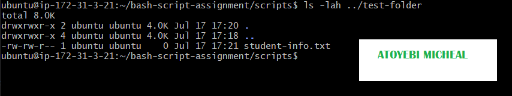

---

#### Screenshot 2 — Content of `file-check.sh`

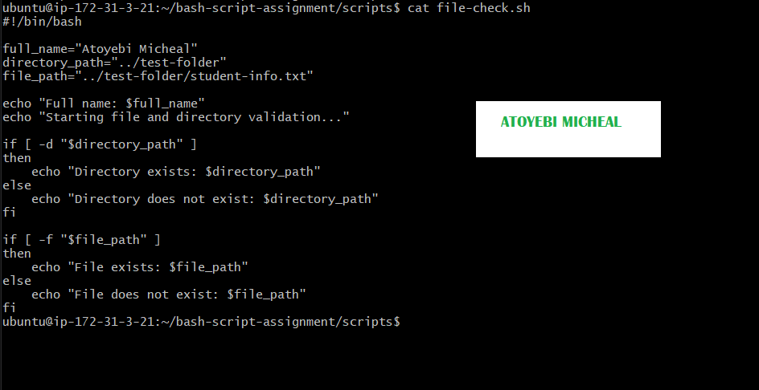

---

#### Screenshot 3 — Output of `./file-check.sh`

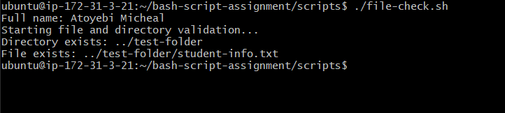

---

### Notes

Answer the following in your own words:

**1. What does `-d` check in Bash?**

-d checks if a directory exists at the specified path.

---

**2. What does `-f` check in Bash?**

-f checks if a file exists and confirms that it is a regular file.

---

**3. Why should file and directory paths be stored in variables?**

Storing paths in variables makes the script easier to read, manage, and update without repeating the same path multiple times.

---

**4. What happens if the file does not exist?**

If the file does not exist, the condition will fail and the script will execute the else block, usually displaying a message that the file is not found.

---

# Task 7 — Conditionals: Pass or Retry Script

## Goal

Use if-else conditionals to make decisions based on a variable value.

### Evidence

#### Screenshot 1 — Content of `score-check.sh` with `score=85`

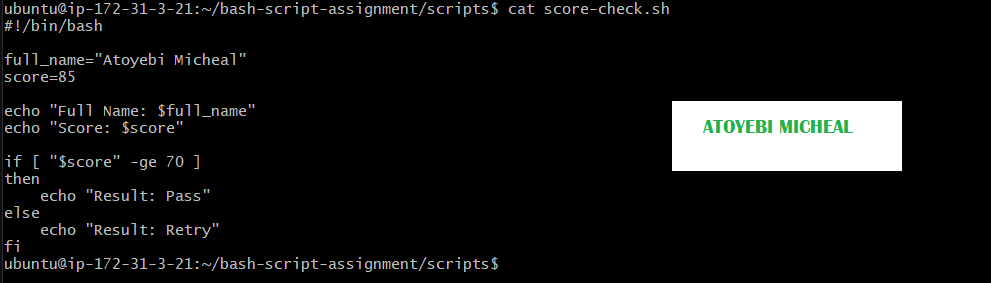

---

#### Screenshot 2 — Output showing `Result: Pass`

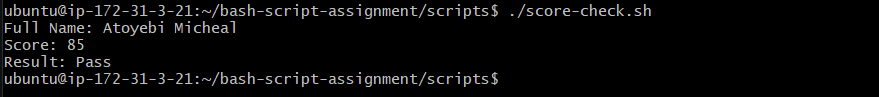

---

#### Screenshot 3 — Content of `score-check.sh` with `score=55`

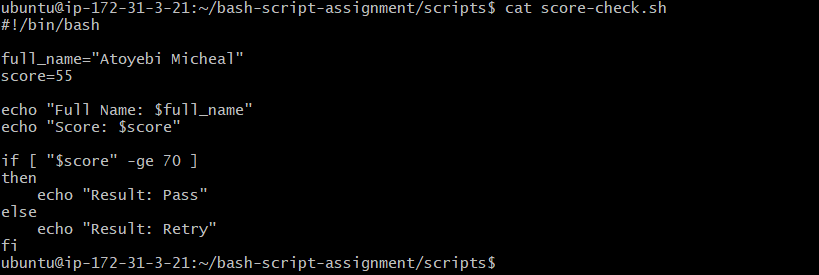

---

#### Screenshot 4 — Output showing `Result: Retry`

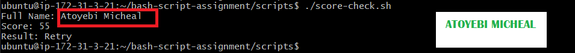

---

### Notes

Answer the following in your own words:

**1. What is the purpose of if-else in Bash?**

The purpose of an if-else statement in Bash is to make decisions in a script. It allows the script to run different commands based on whether a condition is true or false.

---

**2. What does `-ge` mean?**

-ge means “greater than or equal to.” It is used to compare numbers in Bash.

---

**3. Why should conditions be tested with different values?**

Conditions should be tested with different values to make sure the script works correctly in all situations, not just one case.

---

**4. How can conditionals help in automation scripts?**

Conditionals help automation scripts by allowing them to make decisions automatically, such as checking conditions and performing the appropriate action without user input.

---

# Task 8 — Functions: Final Bash Automation Script

## Goal

Create a final Bash script using functions to organize reusable code.

### Evidence

#### Screenshot 1 — Content of `final-automation.sh`

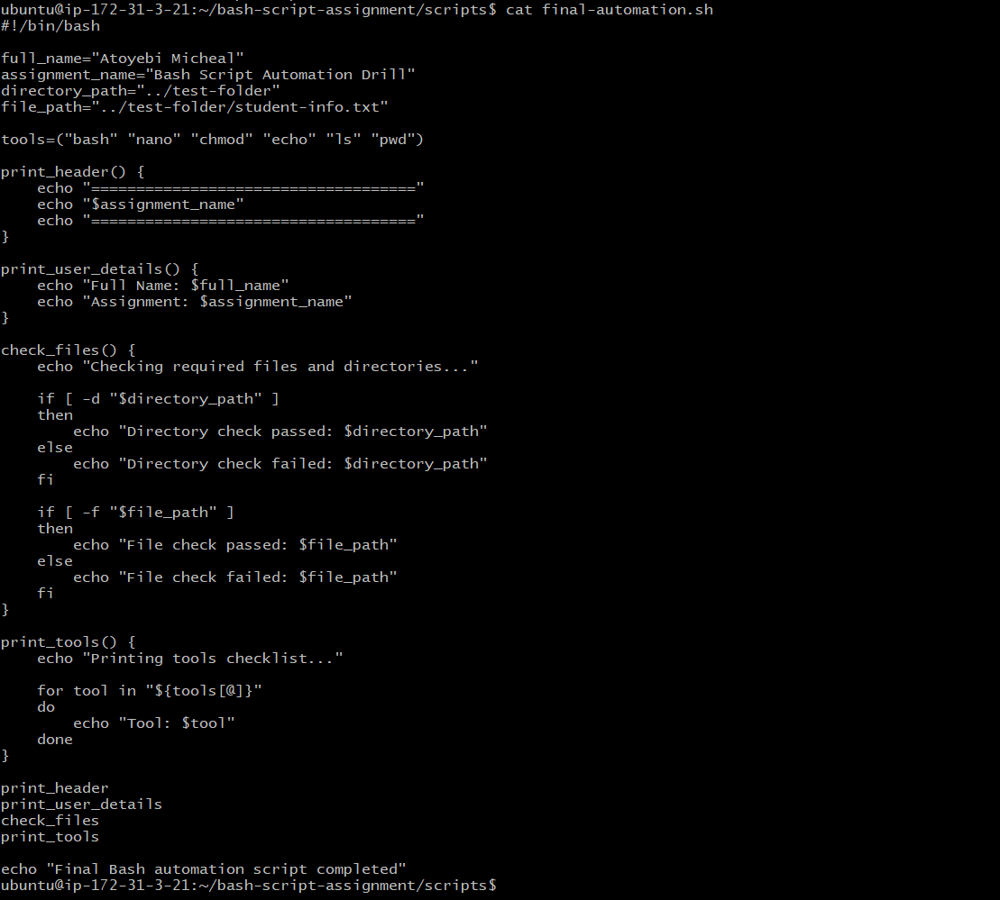

---

#### Screenshot 2 — Output of `./final-automation.sh`

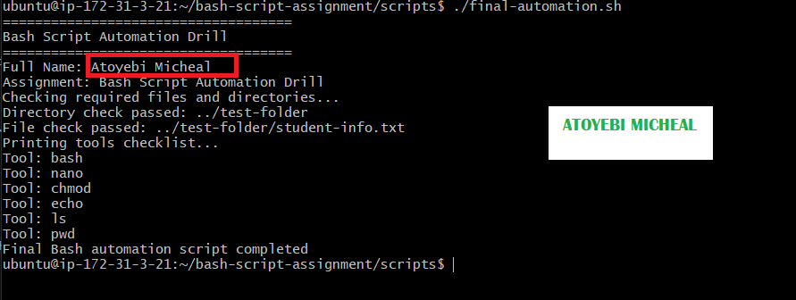

---

#### Screenshot 3 — Output of `ls -lah` showing all created scripts

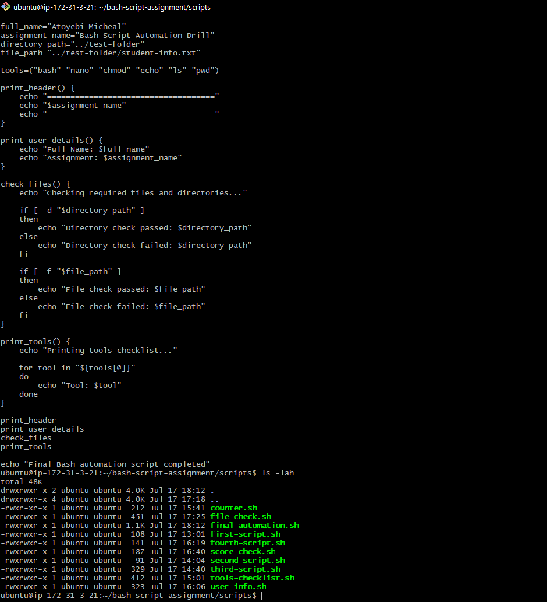

---

### Notes

Answer the following in your own words:

**1. What is a function in Bash?**

A function in Bash is a block of code that is grouped together to perform a specific task and can be reused multiple times within a script.

---

**2. Why are functions useful in scripts?**

Functions are useful because they help organize code, reduce repetition, and make scripts easier to read and maintain.

---

**3. Which functions did you create in this script?**

In this script, I created four functions: print_header, print_user_details, check_files, and print_tools. Each function performs a specific task, such as displaying the script title, showing user information, validating the existence of a directory and file, and listing the tools in the array. This modular approach makes the script more organized, readable, and easier to maintain.
---

**4. How does this final script combine variables, arrays, loops, conditionals, files, and functions?**

The final script combines multiple Bash concepts to create a structured and efficient automation process. Variables are used to store user details and file paths, while an array is used to manage a list of tools. A loop iterates through the array to display each tool. Conditionals are used to check whether the specified directory and file exist, ensuring proper validation. Functions are used to group related tasks into reusable sections, improving code organization. Altogether, these components work together to automate tasks in a clear, logical, and maintainable way.
---

# LinkedIn Post (Required)

## Evidence

#### LinkedIn Post URL

Paste your LinkedIn post URL here:

`https://www.linkedin.com/posts/aamicheal_devops-linux-bashscripting-share-7483974757961400321-GySp/?utm_source=share&utm_medium=member_desktop&rcm=ACoAADFvgDYBsnsyE66xAyq2HzH3Jfsf19WE6JA`

---

#### Screenshot — Published LinkedIn post

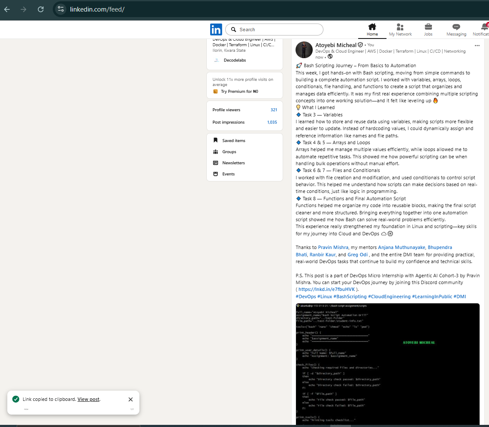

---

# Submission Instructions

- Add all required screenshots in your submission
- Full name must be visible in required screenshots
- All script files must be created and run successfully
- Required notes must be answered clearly for every task
- Do not expose sensitive information (keys, passwords, credentials)

---

# Completion Checklist

- [ ] Task 1: Environment setup verified, workspace created (Screenshots 1–2, Notes answered)
- [ ] Task 2: First script created, executed, permissions verified (Screenshots 1–3, Notes answered)
- [ ] Task 3: Variables script created and run (Screenshots 1–2, Notes answered)
- [ ] Task 4: Arrays and loops script created and run (Screenshots 1–2, Notes answered)
- [ ] Task 5: Counter loop script created and run (Screenshots 1–2, Notes answered)
- [ ] Task 6: File validation script created and run (Screenshots 1–3, Notes answered)
- [ ] Task 7: Pass/Retry conditional script tested with both values (Screenshots 1–4, Notes answered)
- [ ] Task 8: Final automation script created and run (Screenshots 1–3, Notes answered)
- [ ] All scripts run without errors
- [ ] Full Name visible in all required screenshots
- [ ] LinkedIn post published and URL submitted
- [ ] No sensitive data exposed

---

## 📌 About DMI & CloudAdvisory

DevOps Micro Internship (DMI) is a project-based DevOps program run by Pravin Mishra (The CloudAdvisory) focused on real-world execution, systems thinking, and career readiness.

It helps learners build strong DevOps foundations with hands-on experience.

---

## 📌 Resources

- 🌐 DMI Official Website: https://pravinmishra.com/dmi  
- 🎓 DevOps for Beginners (Udemy): https://www.udemy.com/course/devops-for-beginners-docker-k8s-cloud-cicd-4-projects/  
- 🎓 Agentic AI DevOps with Claude Code: https://www.udemy.com/course/ultimate-agentic-ai-devops-with-claude-code/  
- 🎓 DevOps with Claude Code: Terraform, EKS, ArgoCD & Helm: https://www.udemy.com/course/devops-with-claude-code-terraform-eks-argocd-helm/  
- ▶️ YouTube Playlist: https://www.youtube.com/playlist?list=PLFeSNDtI4Cho  
- 🔗 Pravin Mishra (LinkedIn): https://www.linkedin.com/in/pravin-mishra-aws-trainer/  
- 🏢 CloudAdvisory (LinkedIn): https://www.linkedin.com/company/thecloudadvisory/

---

*This submission is part of DevOps Micro Internship (DMI) Cohort 3 — Agentic AI Track.*