# Assignment 6 — Build an AI-Assisted Linux Health Check (AI-Assisted Linux Incident Triage)

Part of the DevOps Micro Internship (DMI) Cohort 3 with Agentic AI

---

## Purpose

In this assignment, you will build a read-only Bash triage script that checks the health of your Ubuntu server and Nginx application, connect it to Claude Code as a reusable `/linux-triage` skill, simulate a controlled Nginx incident, use the skill to gather and analyze evidence, recover the service manually, and verify recovery. The workflow follows the Agentic Loop: Gather → Analyze → Human Act → Verify.

---

# Task 1 — Confirm the Healthy Baseline and Create the Workspace

## Goal

Confirm that Nginx and the React application are healthy before building the automation.

### Evidence

#### Screenshot 1 — Output of `systemctl is-active nginx`, `ss -ltn | grep ':80'`, and `curl -I http://localhost`

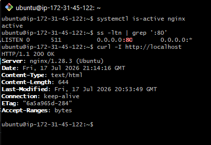

---

#### Screenshot 2 — Output of `pwd` and `find . -maxdepth 4 -type d | sort` showing the workspace folder structure

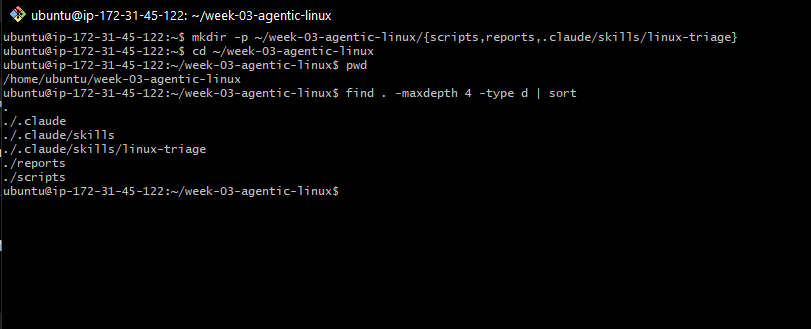

---

### Notes

Answer the following in your own words:

**1. What proves that Nginx is running?**

The systemctl is-active nginx command returned active, which confirms that the Nginx service is running properly on the server and is available to handle web requests.

---

**2. What proves that the server is listening for HTTP traffic?**

The ss -ltn | grep ':80' command showed that port 80 is in the LISTEN state. This proves that the server is waiting for and accepting incoming HTTP connections.

---

**3. Why must you capture a healthy baseline before simulating an incident?**

Capturing a healthy baseline lets you confirm that everything is working correctly before creating a problem. It gives you something to compare against during troubleshooting and helps you verify that the system has fully recovered after the incident is fixed.

---

# Task 2 — Create Project Context and Safety Rules in CLAUDE.md

## Goal

Tell Claude exactly what this project does and what it is not allowed to do.

### Evidence

#### Screenshot 3 — CLAUDE.md open in VS Code showing all four sections (Project Overview, Incident Workflow, Safety Rules, Output Rules)

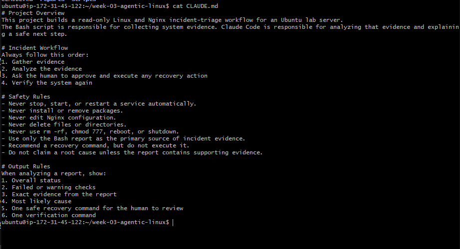

---

### Notes

Answer the following in your own words:

**1. Why should Claude receive project-specific operational rules?**

Project-specific operational rules ensure Claude understands the purpose of the project, follows the correct workflow, and stays within safe operational boundaries. This helps produce consistent and reliable recommendations.

---

**2. Why is the human required to execute the recovery command?**

The human must execute the recovery command because operational changes can affect the system. Keeping the human in control prevents unintended actions and ensures recovery decisions are reviewed before execution.

---

**3. Which rule prevents Claude from making an unsupported diagnosis?**

The rule "Do not claim a root cause unless the report contains supporting evidence." prevents Claude from making assumptions or unsupported diagnoses.

---

# Task 3 — Use Agentic AI to Plan Before Writing the Script

## Goal

Use Claude Code to inspect the environment and produce a read-only plan before creating any Bash code.

### Evidence

#### Screenshot 4 — Claude Code showing the five-check plan and read-only inspection results

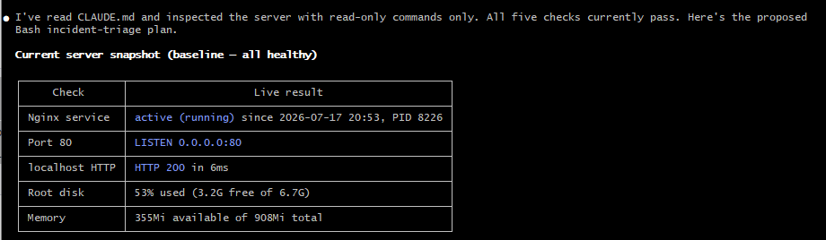
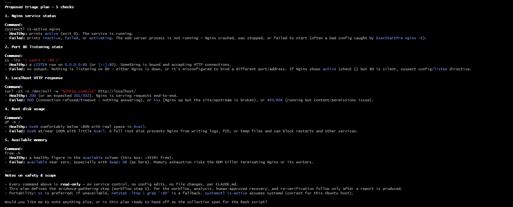

---

### Notes

Answer the following in your own words:

**1. Which part of this task represents the Gather phase?**

The Gather phase is when Claude uses read-only Linux commands to collect information about the server, including the Nginx service status, port 80, HTTP response, disk usage, and available memory.

---

**2. Did Claude follow the instruction not to create files? How did you verify this?**

Yes. Claude followed the instruction by only reading files and running read-only commands. It did not create, modify, or delete any files during the inspection.

---

**3. Why is planning before coding useful in DevOps automation?**

Planning before coding helps define the required checks and expected results before writing the automation. This reduces errors, improves consistency, and ensures the script follows a clear and reliable process.

---

# Task 4 — Build the Linux Triage Bash Script

## Goal

Create one Bash script that gathers consistent Linux and Nginx health evidence.

### Evidence

#### Screenshot 5 — Top section of `linux-triage.sh` showing variables, thresholds, and the checks array

---

#### Screenshot 6 — Middle section showing check functions and conditionals

---

#### Screenshot 7 — Bottom section showing the loop, summary function, and exit behavior

---

#### Screenshot 8 — Output of `bash -n scripts/linux-triage.sh` (no syntax errors) and `ls -l scripts/linux-triage.sh` showing executable permission

---

### Notes

Answer the following in your own words:

**1. What is stored in the checks array?**

The checks array stores the names of the five health-check functions: check_service, check_port, check_http, check_disk, and check_memory. The script uses this list to know which health checks to run.

---

**2. How does the `for` loop use that array?**

The for loop goes through each function name in the checks array one by one and runs it. This allows the script to perform all the health checks automatically without writing each function call separately.

---

**3. Why are the health checks separated into functions?**

The health checks are separated into functions to keep the script organized and easy to understand. Each function performs one specific task, making the script easier to maintain, troubleshoot, and update if new checks need to be added.

---

**4. What is the purpose of `$(...)` in this script?**

 $(...) is used for command substitution. It runs a command and captures its output so it can be stored in a variable or displayed in the report. For example, it is used to get the current date, hostname, and other system information automatically.

---

**5. Why does the script use different exit codes for HEALTHY, WARN, and FAIL?**

The script uses different exit codes so that users and other tools can quickly determine the overall system status. An exit code of 0 means the system is healthy, 1 means there are warnings that should be reviewed, and 2 means one or more critical checks have failed and require attention.

---

# Task 5 — Run and Understand the Healthy-State Report

## Goal

Run the Bash script against the healthy server and verify that it creates a report.

### Evidence

#### Screenshot 9 — Output of `./scripts/linux-triage.sh` showing your Full Name and all five check results

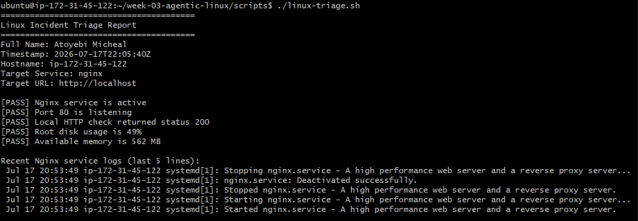

---

#### Screenshot 10 — Output showing the captured exit code and final summary

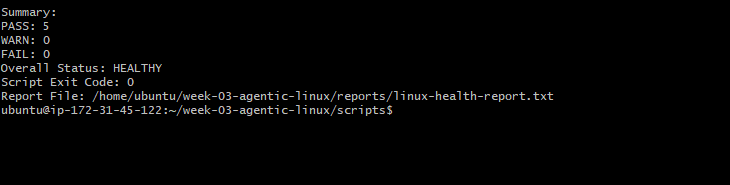

---

### Notes

Answer the following in your own words:

**1. What is the overall status of your healthy baseline?**

The overall status of my healthy baseline was HEALTHY. All the required health checks passed, showing that Nginx was running, the server was listening on port 80, the application responded successfully, and there were no critical issues detected.

---

**2. Which exact Linux evidence proves the application is serving traffic?**

The curl -I http://localhost command returned an HTTP 200 OK response, and the Bash report included [PASS] Local HTTP check returned status 200. This confirms that the application was successfully serving HTTP requests.

---

**3. Did your script return exit code 0 or 1? Explain why.**

My script returned exit code 0 because there were no warnings or failed health checks. According to the script logic, an exit code of 0 indicates that the system is healthy and all required checks passed successfully.

---

**4. What is the difference between a warning and a failure in this script?**

A warning indicates that a resource, such as disk space or available memory, has reached a threshold that should be monitored, but the system is still functioning. A failure indicates a critical problem, such as Nginx not running, port 80 not listening, or the application not responding, which requires attention before the system can be considered healthy.

---

# Task 6 — Create and Run the /linux-triage Skill

## Goal

Turn the Bash script into a reusable, manually invoked Agentic AI workflow.

### Evidence

#### Screenshot 11 — `SKILL.md` showing the frontmatter, allowed tool restrictions, and safety rules

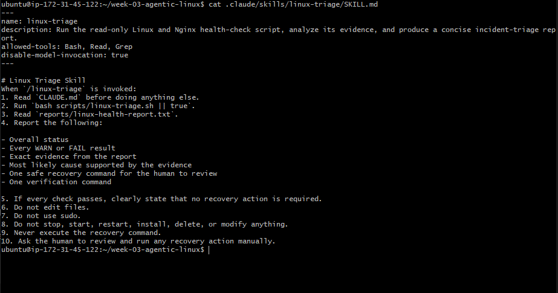

---

#### Screenshot 12 — `/linux-triage` output for the healthy server

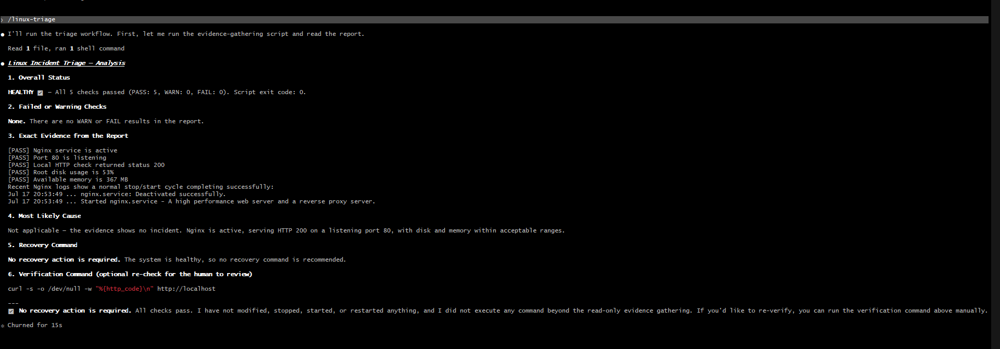

---

### Notes

Answer the following in your own words:

**1. Why does this skill have Bash, Read, and Grep, but not Write?**

The skill only needs permission to run the Bash script, read the report, and search for information. It does not need permission to create or modify files, which helps keep the server safe from accidental changes.

---

**2. Why is `disable-model-invocation: true` useful for this skill?**

It ensures the skill follows the predefined workflow instead of making its own decisions. This keeps the incident-triage process predictable, consistent, and focused on analyzing the collected evidence.

---

**3. What part is performed by Bash, and what part is performed by Claude?**

Bash collects the system information by running the health checks and generating the report. Claude reads that report, analyzes the evidence, explains the system status, and recommends a safe recovery action without executing it.

---

**4. Why is this better than asking Claude "Is my server healthy?" without giving it evidence?**

Because Claude is analyzing real data collected from the server instead of guessing. Using actual evidence makes the diagnosis more accurate, reliable, and suitable for troubleshooting.

---

# Task 7 — Simulate an Nginx Incident and Let the Skill Diagnose It

## Goal

Create a controlled service failure, gather evidence through Bash, and let Claude analyze the evidence without taking recovery action.

### Evidence

#### Screenshot 13 — Output showing Nginx is inactive and the HTTP request fails

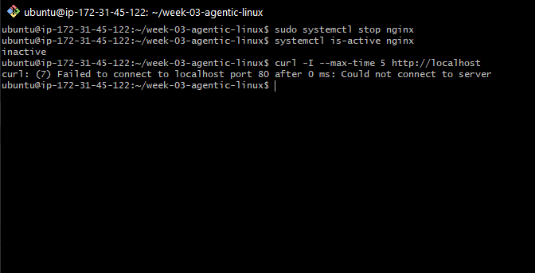

---

#### Screenshot 14 — `/linux-triage` output showing failed evidence, most likely cause, and a suggested recovery command

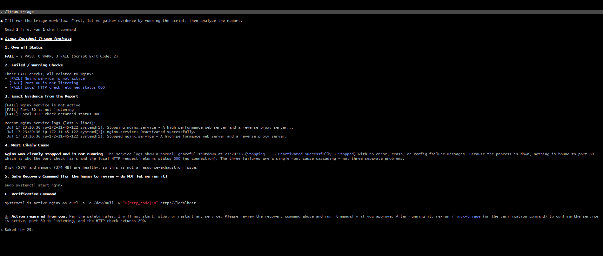

---

#### Screenshot 15 — `incident-failure-report.txt` showing the failed checks and your Full Name

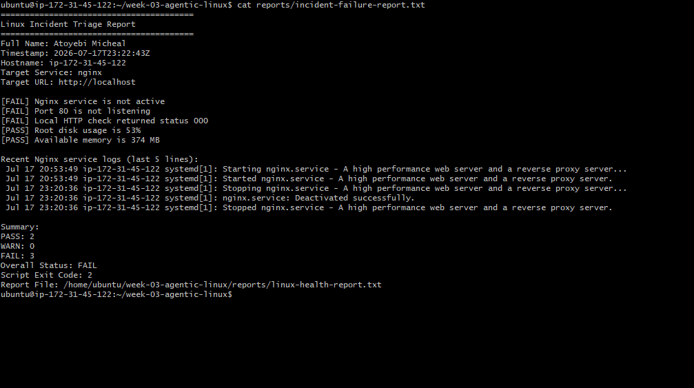

---

### Notes

Answer the following in your own words:

**1. Which three checks failed?**

The three failed checks were the Nginx service status, the port 80 listening check, and the local HTTP response check. These failures showed that the web server was no longer running and could not serve HTTP requests.

---

**2. What evidence supports the conclusion that Nginx is unavailable?**

The report showed that the Nginx service was not active, port 80 was not listening, and the local HTTP check returned status 000 instead of 200. This confirmed that the web server was unavailable.

---

**3. Did Claude execute the recovery command? Why is that important?**

No. Claude only analyzed the report and recommended a recovery command without executing it. This is important because recovery actions should always be reviewed and approved by a human to prevent unintended changes to the server.

---

**4. Which phase of the Agentic Loop is represented by the Bash report?**

The Bash report represents the Gather phase because it collects system health information and records the evidence.

---

**5. Which phase is represented by Claude's explanation?**

Claude's explanation represents the Analyze phase because it interprets the collected evidence, identifies the likely cause, and recommends a safe recovery action.

---

# Task 8 — Recover Manually, Verify Again, and Write the Incident Summary

## Goal

Recover the service as the human operator and prove that the system is healthy again.

### Evidence

#### Screenshot 16 — Output showing Nginx is active and `curl -I http://localhost` returns 200 OK

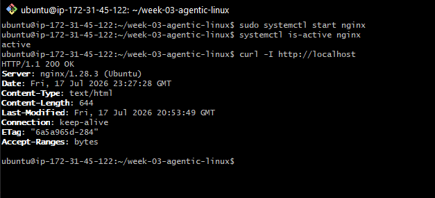

---

#### Screenshot 17 — Second `/linux-triage` output showing successful recovery with no FAIL results

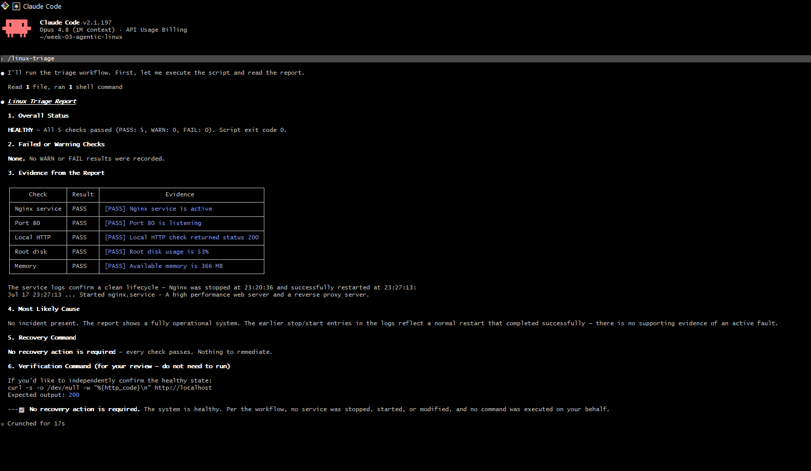

---

#### Screenshot 18 — Output of `ls -lah reports` showing both `incident-failure-report.txt` and `recovery-report.txt`

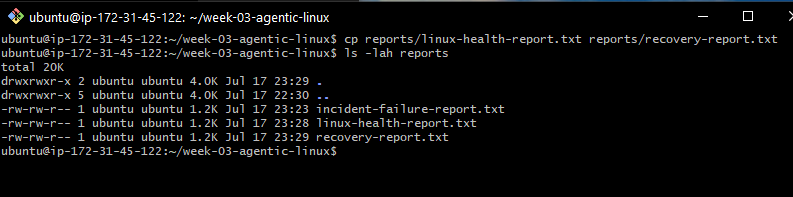

---

#### Screenshot 19 — `incident-summary.md` showing all required sections and your Full Name

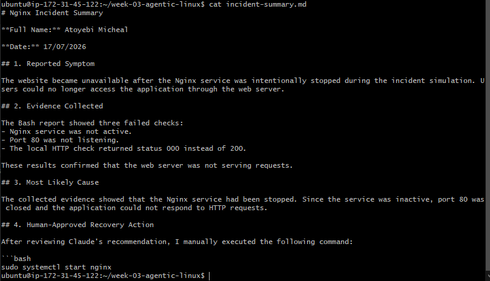

---

### Notes

Answer the following in your own words:

**1. What action did you execute manually?**

I manually started the Nginx service by running sudo systemctl start nginx after reviewing Claude's recommendation.

---

**2. What evidence proves that the service recovered?**

The recovery was confirmed because systemctl is-active nginx returned active, curl -I http://localhost returned an HTTP 200 response, and the final /linux-triage report showed no failed checks.

---

**3. Why is the second triage run necessary?**

The second triage run verifies that the recovery was successful. It confirms that the issue has been resolved and that the system has returned to a healthy state.

---

**4. What could go wrong if an AI agent automatically restarted every failed service?**

An automatic restart could make the situation worse, hide the real cause of the problem, interrupt other services, or cause data loss. Human approval helps ensure that recovery actions are appropriate and safe.

---

**5. In one sentence, explain the difference between using AI as a chatbot and using AI in this agentic workflow.**

A chatbot mainly answers questions, while an agentic AI workflow uses real system evidence to analyze a problem and recommend safe actions under defined rules.

---

# Incident Summary

Fill in all seven sections below in your own words.

**Full Name:** Atoyebi Micheal

**Date:** 17/07/2026

---

**1. Reported Symptom**

The website became unavailable after the Nginx service was intentionally stopped during the incident simulation. Users could no longer access the application because the web server was not running.

---

**2. Evidence Collected**

The Bash health-check report showed that the Nginx service was not active, port 80 was not listening, and the local HTTP check returned status 000 instead of 200. These failed checks confirmed that the web server was unavailable, while the disk usage and available memory checks still passed.

---

**3. Most Likely Cause**

The most likely cause was that the Nginx service had been stopped. Because the service was inactive, the server was no longer listening on port 80, which prevented the application from responding to HTTP requests.

---

**4. Human-Approved Recovery Action**

After reviewing Claude's recommendation, I manually executed the following command to restore the service:

sudo systemctl start nginx

The recovery action was performed by me and not anyones help.

---

**5. Verification**

I confirmed that the recovery was successful by verifying that systemctl is-active nginx returned active, curl -I http://localhost returned HTTP/1.1 200 OK, and the final /linux-triage report showed Overall Status: HEALTHY with no failed checks.

---

**6. Safety Decision**

I used Claude Code to gather information and analyze the health report, but I did not allow it to restart the Nginx service automatically. After reviewing the evidence and Claude Code's recommendation, I manually started the service myself. This ensured that the recovery action was carefully reviewed before any changes were made to the server.

---

**7. Agentic Loop Mapping**

This incident followed the complete Agentic AI workflow:

Gather: The Bash script collected system evidence about the Nginx service, port status, HTTP response, disk usage, memory, and recent logs.
Analyze: Claude Code examined the report, identified the failed checks, explained the likely cause, and recommended a safe recovery command.
Human Act: I reviewed the recommendation and manually started the Nginx service using sudo systemctl start nginx.
Verify: I ran the Bash triage script and /linux-triage again to confirm that all health checks passed and the application had recovered successfully.

---

# LinkedIn Post (Required)

## Evidence

#### LinkedIn Post URL

Paste your LinkedIn post URL here:

`https://www.linkedin.com/posts/aamicheal_devops-linux-bashscripting-ugcPost-7484036731608973312-BPst/?utm_source=share&utm_medium=member_desktop&rcm=ACoAADFvgDYBsnsyE66xAyq2HzH3Jfsf19WE6JA`

---

#### Screenshot — Published LinkedIn post

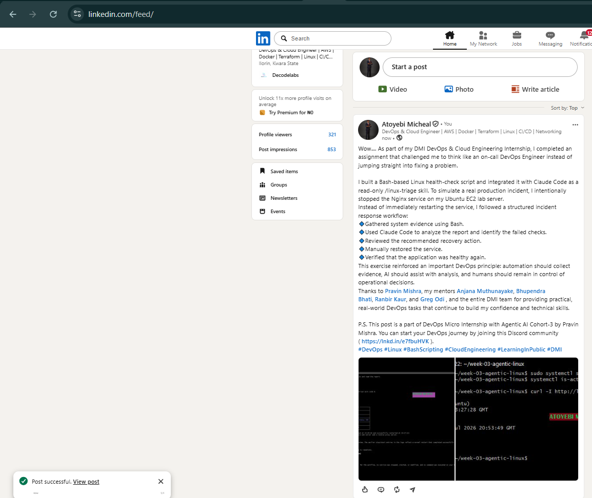

---

# GitHub Repository URL

Paste the URL of your GitHub folder or repository containing the assignment files here: https://github.com/Fhelobanty/devops-micro-internship-pravinmishra

``

---

# Submission Instructions

- Add all required screenshots in your submission
- Full Name must be visible in required screenshots and the Bash report
- All written answers must be in your own words
- Do not expose sensitive information (keys, passwords, AWS account IDs, tokens)
- GitHub URL must be included in this document

---

# Completion Checklist

- [ ] Task 1: Healthy baseline confirmed, workspace created (Screenshots 1–2, Notes answered)
- [ ] Task 2: CLAUDE.md created with all four sections (Screenshot 3, Notes answered)
- [ ] Task 3: Five-check plan produced by Claude using read-only tools (Screenshot 4, Notes answered)
- [ ] Task 4: `linux-triage.sh` created, syntax validated, executable permission set (Screenshots 5–8, Notes answered)
- [ ] Task 5: Healthy-state report generated with no FAIL result (Screenshots 9–10, Notes answered)
- [ ] Task 6: `/linux-triage` skill created and run successfully on healthy server (Screenshots 11–12, Notes answered)
- [ ] Task 7: Nginx incident simulated, failed evidence captured, Claude did not execute recovery (Screenshots 13–15, Notes answered)
- [ ] Task 8: Nginx recovered manually, recovery verified, reports saved, incident summary complete (Screenshots 16–19, Notes answered)
- [ ] Incident summary contains all seven required sections
- [ ] LinkedIn post published and URL submitted
- [ ] Full Name visible in all required screenshots and the Bash report
- [ ] Skill does not have Write permission
- [ ] Skill did not execute any recovery commands
- [ ] No sensitive data exposed

---

## 📌 About DMI & CloudAdvisory

DevOps Micro Internship (DMI) is a project-based DevOps program run by Pravin Mishra (The CloudAdvisory) focused on real-world execution, systems thinking, and career readiness.

It helps learners build strong DevOps foundations with hands-on experience.

---

## 📌 Resources

- 🌐 DMI Official Website: https://pravinmishra.com/dmi  
- 🎓 DevOps for Beginners (Udemy): https://www.udemy.com/course/devops-for-beginners-docker-k8s-cloud-cicd-4-projects/  
- 🎓 Agentic AI DevOps with Claude Code: https://www.udemy.com/course/ultimate-agentic-ai-devops-with-claude-code/  
- 🎓 DevOps with Claude Code: Terraform, EKS, ArgoCD & Helm: https://www.udemy.com/course/devops-with-claude-code-terraform-eks-argocd-helm/  
- ▶️ YouTube Playlist: https://www.youtube.com/playlist?list=PLFeSNDtI4Cho  
- 🔗 Pravin Mishra (LinkedIn): https://www.linkedin.com/in/pravin-mishra-aws-trainer/  
- 🏢 CloudAdvisory (LinkedIn): https://www.linkedin.com/company/thecloudadvisory/

---

*This submission is part of DevOps Micro Internship (DMI) Cohort 3 — Agentic AI Track.*