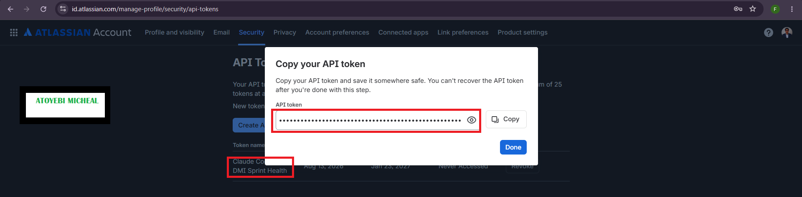
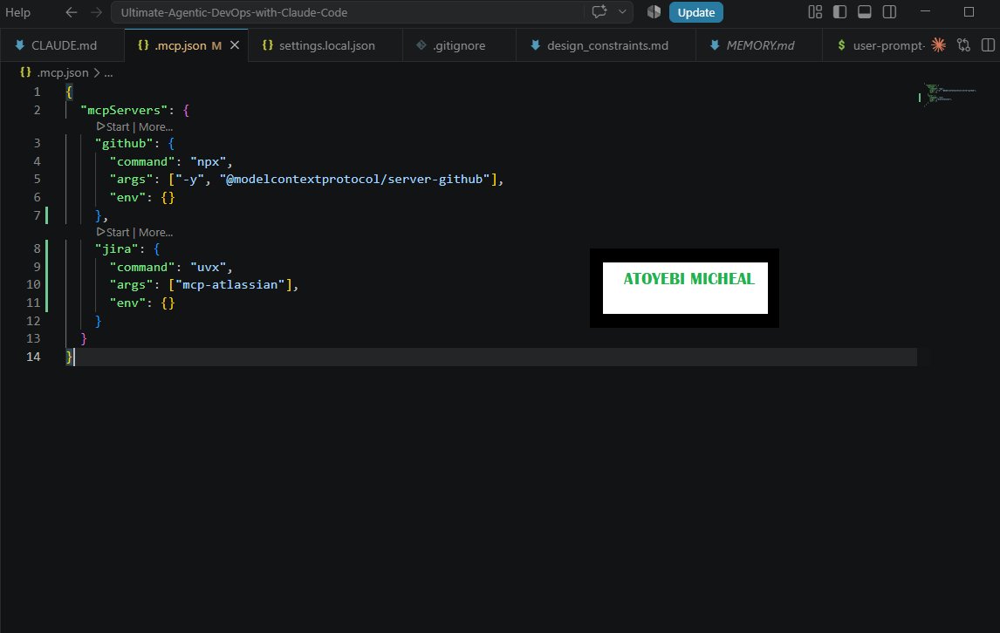
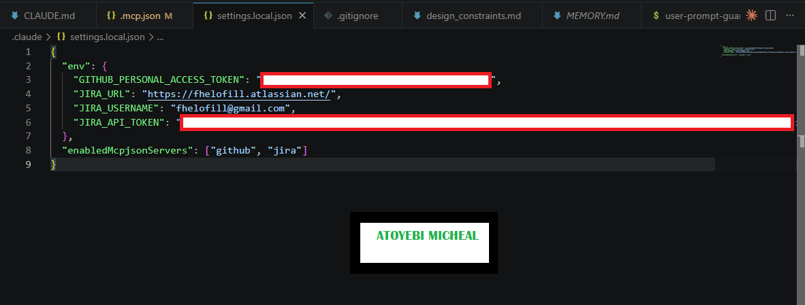
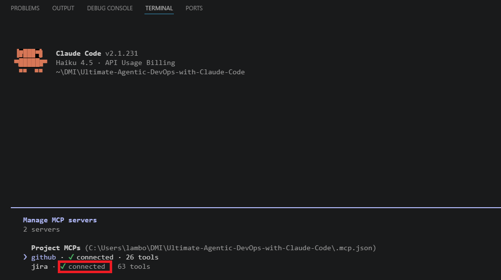
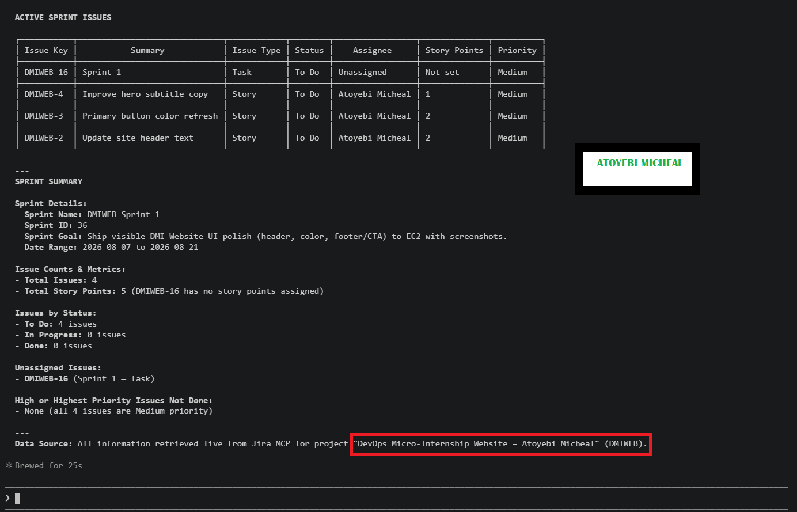
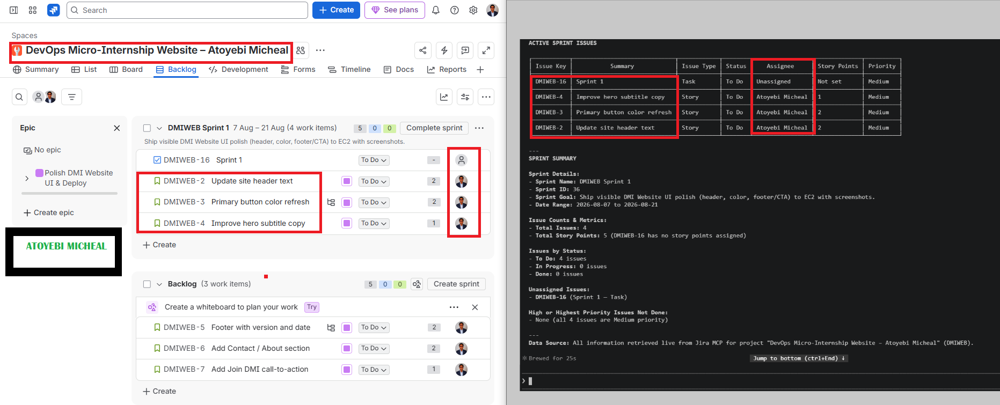
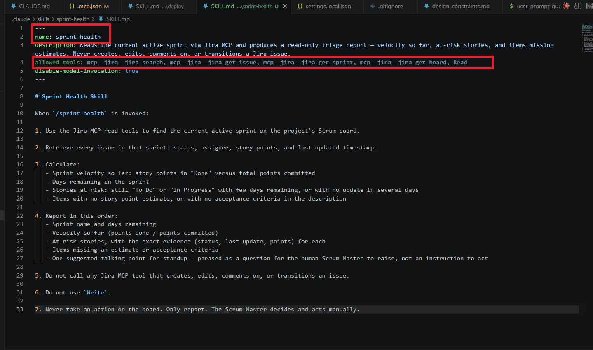
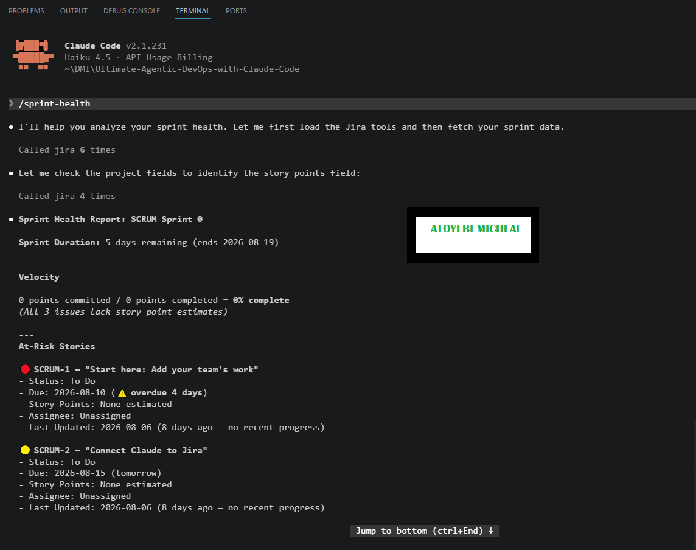
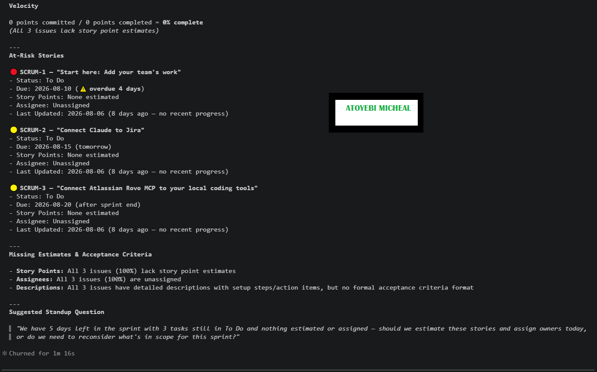
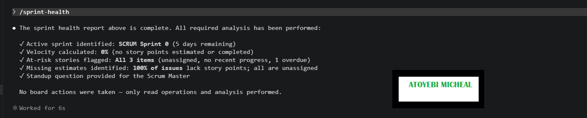

# Assignment 5 — AI-Assisted Sprint Health Report via Jira MCP

Part of the DevOps Micro Internship (DMI) Cohort 3 with Agentic AI

---

## Purpose

In this assignment, you will connect Claude Code to your Jira board through an MCP server, the same way you connected it to GitHub in Week 2, and build a read-only `/sprint-health` skill. The skill reads your current sprint through Jira's API and reports sprint velocity, stories at risk of missing the sprint, and items missing an estimate — but it must never create, edit, comment on, or transition a single ticket itself. You will prove that boundary holds by making a real change on the board yourself and confirming the skill only ever reports, never acts.

---

# Task 1 — Create a Jira API Token

## Goal

Generate an API token from your Atlassian account that the MCP server will use to authenticate with your Jira site. Do not screenshot the token value itself.

### Evidence

#### Screenshot 1 — Jira API token creation confirmation page showing the token name, with the token value not visible

### Notes You Must Write (Very Important):

Why does the MCP server need your site URL and account email in addition to the token?

The Jira site URL tells the MCP server which Jira Cloud site it needs to connect to. The account email identifies the Atlassian account that owns the API token, while the API token provides the authentication credential used to access Jira. The three pieces work together so the MCP server can authenticate as the correct Atlassian user and access the correct Jira site.
---

# Task 2 — Create .mcp.json at the Project Root

## Goal

Create or update `.mcp.json` at your project root with a Jira MCP server block, following the same shape as the GitHub MCP server you configured in Week 2.

### Evidence

#### Screenshot 2 — `.mcp.json` open in VS Code showing the Jira server configuration

### Notes You Must Write (Very Important):

Compare this jira block to the github block from Week 2 Assignment 5. The GitHub server ran via npx (a Node.js package); this one runs via uvx (a Python package) — what stays exactly the same shape despite that difference, and why doesn't Claude Code care which language a given MCP server is written in?

The `jira` and `github` blocks keep the same `command` / `args` / `env` structure. Each MCP server configuration tells Claude Code which executable to run, which arguments to pass to it, and which environment variables to provide. The difference is that the GitHub server uses `npx`, while the Jira server uses `uvx`.

Claude Code does not care which programming language an MCP server is written in because it does not need to interact with the server's source code. It simply launches the configured command and communicates with the running server through the Model Context Protocol (MCP). As long as the server correctly follows the MCP protocol, the underlying language—such as Node.js/JavaScript or Python—is not important to Claude Code.

---

# Task 3 — Add Your Credentials to settings.local.json

## Goal

Add your Jira site URL, account email, and API token to `.claude/settings.local.json`, and confirm that file is listed in `.gitignore` so it is never committed.

### Evidence

#### Screenshot 3 — `settings.local.json` open in VS Code showing the `env` section, with the actual token value blurred or covered

### Notes You Must Write (Very Important):

Why must JIRA_API_TOKEN live in settings.local.json and never in .mcp.json?

JIRA_API_TOKEN is a secret credential and must be kept in the local settings.local.json file so it is not exposed or accidentally committed to the GitHub repository. The settings.local.json file is intended for machine-specific secrets and should be listed in .gitignore, while .mcp.json is a project configuration file that can safely be shared and committed. The .mcp.json file only defines how the Jira MCP server is launched, using uvx and mcp-atlassian; the authentication credentials are supplied separately through the local environment settings. Keeping the token separate protects the Jira account from unauthorized access if the project configuration is shared publicly.

---

# Task 4 — Verify the Connection with /mcp

## Goal

Restart Claude Code and confirm the Jira MCP server shows as connected.

### Evidence

#### Screenshot 4 — `/mcp` output showing `jira: connected`

---

# Task 5 — Run a Live Query to Prove Real Board Data

## Goal

Ask Claude to list the issues in your current active sprint through the Jira MCP connection, and confirm the result matches what you see on your live board in the browser.

### Evidence

#### Screenshot 5 — Claude's response showing the live sprint issue list retrieved via Jira MCP

### Notes You Must Write (Very Important):

How did you confirm this was real board data and not something Claude guessed?

I confirmed the data was real by comparing Claude's Jira MCP response with the live active sprint on my Jira board. The issue keys, summaries, statuses, assignees, story points, and priorities matched the issues currently displayed in Jira. The information was retrieved through the Jira MCP tools rather than being supplied to Claude manually, demonstrating that Claude was reading the live Jira board instead of generating or guessing the information.

---

# Task 6 — Build the /sprint-health Skill

## Goal

Create a `/sprint-health` skill restricted to read-only Jira tools plus `Read`, with no issue-mutating tools and no `Write`. Run it and confirm it produces a report covering sprint velocity, at-risk stories, and items missing an estimate.

### Evidence

#### Screenshot 6 — `SKILL.md` frontmatter showing `allowed-tools` limited to read-only Jira tools plus `Read`, with `disable-model-invocation: true`

#### Screenshot 7 — `/sprint-health` output showing the full triage report against your real sprint

### Notes You Must Write (Very Important):

1. Which Jira MCP tools does this skill's allowed-tools list include, and which mutating tools (create issue, update issue, transition issue, add comment) does it deliberately exclude?

The skill allows only the Jira MCP read tools jira_search, jira_get_issue, jira_get_sprint, and jira_get_board, together with the Read tool. It deliberately excludes all Jira mutation capabilities, including creating issues, updating issues, transitioning issues, and adding comments. It also excludes Write, ensuring that the skill is restricted to reading and reporting Jira data rather than changing it.

2. Why does a Scrum Master need this restriction more than almost any other role in this course?

A Scrum Master needs this restriction because the Scrum Master is accountable for maintaining the integrity of the team's board and facilitating human decision-making. An AI that could silently change statuses, estimates, comments, or other ticket information could alter the team's source of truth without human approval. Keeping the skill read-only allows AI to identify risks and provide evidence while the Scrum Master remains responsible for deciding and making any changes to the Jira board.

---

# Task 7 — Prove the Skill Never Mutates the Board

## Goal

Manually update one ticket on your board in the browser (for example, move a story to "Done" or add a missing estimate), then run `/sprint-health` again and confirm the new report reflects your change — proving the skill only ever reads live state and never wrote to the board itself.

### Evidence

#### Screenshot 8 — Second `/sprint-health` run showing the report now reflects your manual board change

### Notes You Must Write (Very Important):

Map this assignment to Gather → Analyze → Human Act → Verify from Week 3 Assignment 6. Which step did you perform manually in the browser, and why must that step stay human?

 Gather: The Jira MCP gathered the current sprint information from the live Jira board.

Analyze: The /sprint-health skill analyzed the sprint data, including statuses, estimates, velocity, and potential risks.

Human Act: I manually changed a Jira ticket in the browser by moving it from To Do to In Progress. This step must remain human because changing the team's source of truth is a Scrum Master/team decision and should not be performed automatically by an AI assistant.

Verify: I ran /sprint-health again and confirmed that the report reflected my manual change. This demonstrated that the skill reads the live Jira state but does not make changes to the board itself.

---

# Submission Instructions

Complete all tasks in sequence.

Your submission must include:
- All 8 required screenshots
- All the required notes

---

# Completion Checklist

- [ ] Task 1: Jira API token created, value never screenshotted (Screenshot 1)
- [ ] Task 2: `.mcp.json` has the Jira server block (Screenshot 2)
- [ ] Task 3: Credentials stored in `settings.local.json`, token blurred, file gitignored (Screenshot 3)
- [ ] Task 4: `/mcp` shows the Jira server connected (Screenshot 4)
- [ ] Task 5: Live query returned real sprint data, verified against the browser (Screenshot 5)
- [ ] Task 6: `/sprint-health` skill created with correct read-only `allowed-tools`, and produced a full report (Screenshots 6–7)
- [ ] Task 7: A manual board change was reflected in a second `/sprint-health` run (Screenshot 8)
- [ ] Skill never created, edited, transitioned, or commented on any issue
- [ ] Reflection answered (Notes)
- [ ] No API token value exposed

---

## 📌 About DMI & CloudAdvisory

DevOps Micro Internship (DMI) is a project-based DevOps program run by Pravin Mishra (The CloudAdvisory) focused on real-world execution, systems thinking, and career readiness.

It helps learners build strong DevOps foundations with hands-on experience.

---

## 📌 Resources

- 🌐 DMI Official Website: https://dmi.pravinmishra.com?utm_source=github&utm_medium=readme  
- 🎓 University: https://university.pravinmishra.com?utm_source=github&utm_medium=readme  
- 💬 Discord Community: https://discord.pravinmishra.com?utm_source=github&utm_medium=readme  
- 📝 Blog: https://dmi.pravinmishra.com/blog?utm_source=github&utm_medium=readme  
- ▶️ YouTube Playlist: https://www.youtube.com/playlist?list=PLFeSNDtI4Cho  
- 🔗 Pravin Mishra (LinkedIn): https://www.linkedin.com/in/pravin-mishra-aws-trainer/  
- 🏢 CloudAdvisory (LinkedIn): https://www.linkedin.com/company/thecloudadvisory/

---

*This submission is part of DevOps Micro Internship (DMI) Cohort 3 — Agentic AI Track.*
