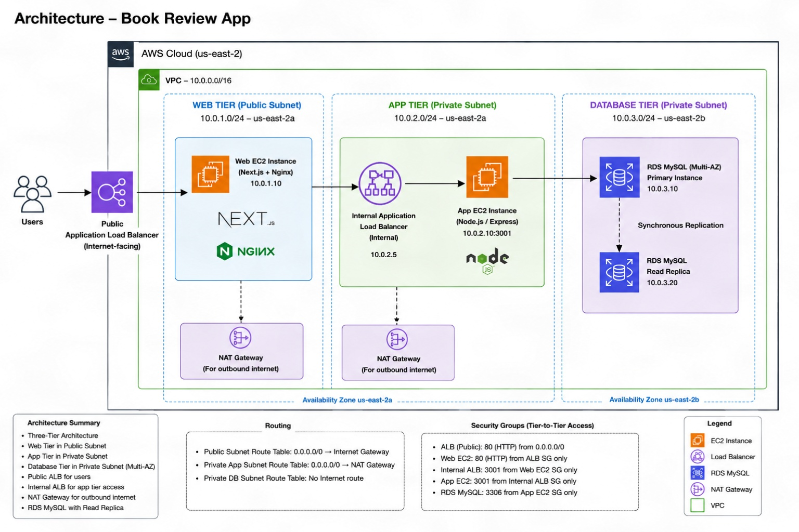
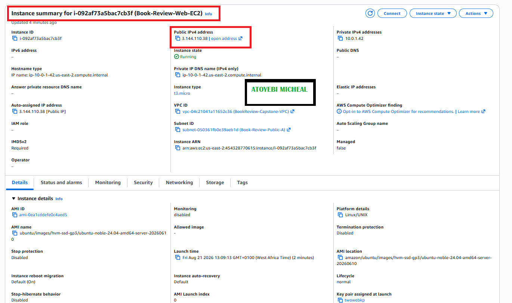
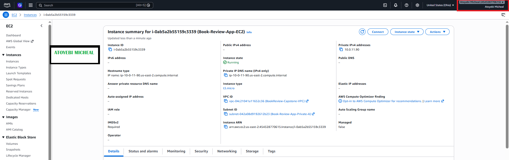
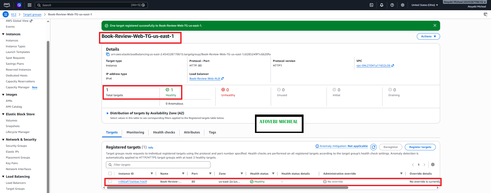
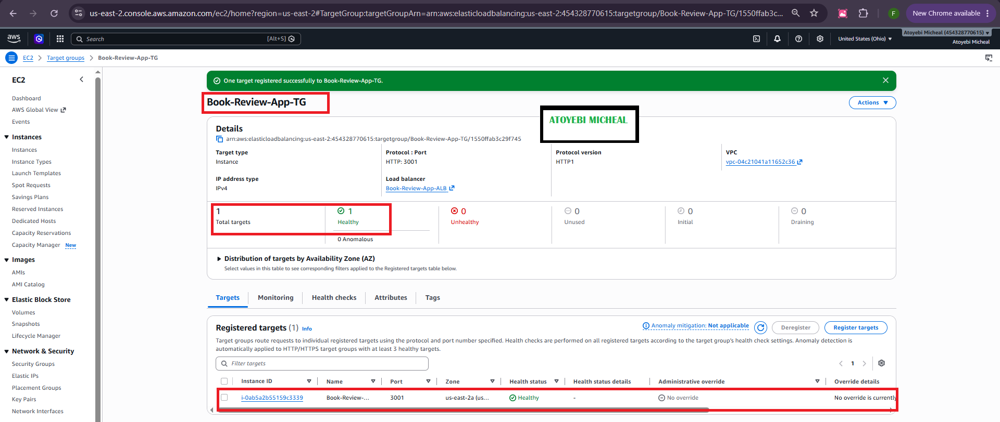
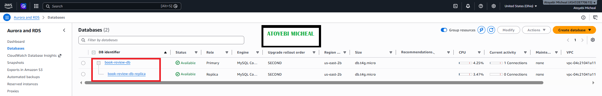
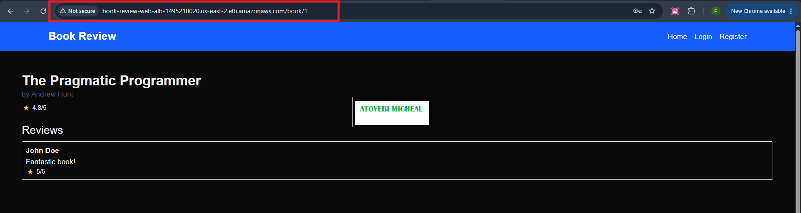
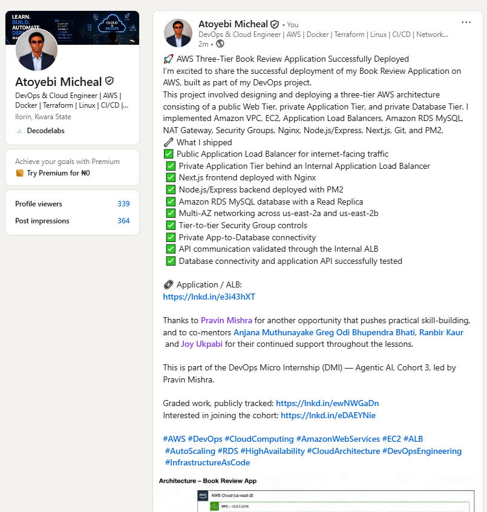

# Assignment 6 — Capstone: Deploy Book Review App (Three-Tier Architecture) on AWS

Part of the DevOps Micro Internship (DMI) Cohort 3 with Agentic AI

---

## Purpose

This is the most important assignment of the course. You will deploy the Book Review App in a fully production-style three-tier architecture on AWS: a Next.js Web Tier behind Nginx and a public ALB, a private Node.js/Express App Tier behind an internal ALB, and a private Multi-AZ MySQL RDS database with a read replica. You are expected to design, deploy, isolate, debug, and document the result independently.

---

# Task 1 — Architecture Diagram

## Goal

Create an architecture diagram showing the custom VPC (10.0.0.0/16), the six subnets across two Availability Zones (two public Web Tier, two private App Tier, two private Database Tier), the public ALB, Web Tier EC2/Nginx, internal ALB, private App Tier EC2, private Multi-AZ RDS with its read replica, and the permitted traffic flow.

### Evidence

#### Diagram image or link

---

# Task 2 — AWS Region & Services Used

## Goal

Record the AWS Region used and list every AWS service used across networking, compute, load balancing, security, and the database.

### Notes

**Region:**

US East (Ohio) — us-east-2

---

**Services used:**

Amazon VPC, Amazon EC2, Application Load Balancer (Public and Internal), Amazon RDS for MySQL, RDS Read Replica, NAT Gateway, Route Tables, Security Groups, Nginx, Node.js/Express, Next.js, PM2, and MySQL.

---

# Task 3 — Public Entry Point

## Goal

Confirm the Book Review App loads through the public ALB DNS name.

### Evidence

#### Public ALB DNS

Paste your public ALB DNS name here:

`http://book-review-web-alb-1495210020.us-east-2.elb.amazonaws.com/book/1`

---

# Task 4 — Evidence Screenshots

## Goal

Capture visual proof of every tier and load balancer.

### Evidence

#### Screenshot 1 — Web Tier EC2 instance in a public subnet

---

#### Screenshot 2 — App Tier EC2 instance in a private subnet

---

#### Screenshot 3 — Public Application Load Balancer configuration or healthy targets

---

#### Screenshot 4 — Internal Application Load Balancer configuration or healthy targets

---

#### Screenshot 5 — Amazon RDS for MySQL showing Multi-AZ and the read replica

---

#### Screenshot 6 — Book Review App UI working through the public ALB

---

# Task 5 — Summary

## Goal

Summarize what worked in the final deployment, the issues encountered and how each was fixed, and the tools or sources used to research and debug.

### Notes

**What worked:**

The Book Review App was successfully deployed in a three-tier AWS architecture using US East (Ohio) — us-east-2. A custom VPC with separate public Web Tier, private App Tier, and private Database Tier subnets was configured across two Availability Zones. The Web Tier runs Next.js behind Nginx and a public Application Load Balancer, while the Node.js/Express backend runs privately behind an internal Application Load Balancer. Amazon RDS for MySQL was deployed in the private Database Tier with Multi-AZ and a read replica.

The complete backend application path was successfully validated. The App Tier connects to the RDS database, the internal ALB successfully forwards traffic to the App EC2 on port 3001, and the /api/books endpoint returns the three database records successfully. The public ALB successfully reaches the Web EC2 and the frontend is accessible through the public ALB.

---

**Issues encountered and fixes:**

1. App EC2 SSH connection timed out — The private App EC2 was not directly accessible from the internet. The Web EC2 was used as the access point through the private network, allowing secure connectivity to the private App Tier.
2. Git was not installed on the App EC2 — Git was installed before cloning the Book Review App repository.
3. RDS endpoint initially failed to resolve — The database endpoint was corrected to the RDS endpoint in the us-east-2 region.
4. Public ALB initially returned an error because the Web EC2 had not been registered with its target group — The Web EC2 was registered on port 80, after which the Public ALB target became healthy.
5. The frontend initially could not retrieve books — The Nginx configuration was updated so API requests were forwarded to the internal ALB on port 3001. This restored the Web EC2 → Internal ALB → App EC2 API path.
6. Frontend API path contained a duplicated /api path — The Next.js frontend was corrected from /api/api/books to /api/books, followed by a new production build.
7. The backend PM2 process initially failed with EADDRINUSE — An older manually running Node.js process was occupying port 3001. The old process was terminated and the backend was restarted successfully under PM2.
8. Backend and database connectivity were validated — The /api/books endpoint returned HTTP 200 OK with three book records, and registration through the internal ALB returned HTTP 201 Created.

---

**Tools/sources used:**

AWS Console, Ubuntu/Linux CLI, Nginx, Node.js/Express, Next.js, PM2, MySQL client, Git/GitHub, curl, AWS documentation, technical research resources, and ChatGPT.

---

# LinkedIn Post (Required)

## Goal

Publish a LinkedIn post sharing the capstone deployment, including the public ALB DNS (or a redacted screenshot), three to five lines on what you built and why it is production-style, and one proof screenshot.

## Evidence

#### LinkedIn Post URL

Paste your LinkedIn post URL here:

`Add your URL here`

---

#### Screenshot — Published LinkedIn post

---

# Submission Instructions

- Add all required screenshots and links in your submission
- Do not expose passwords, RDS credentials, connection strings, private keys, or account IDs

---

# Completion Checklist

- [ ] Task 1: Architecture diagram completed
- [ ] Task 2: AWS Region and services documented
- [ ] Task 3: Public ALB DNS confirmed working
- [ ] Task 4: All six evidence screenshots captured (Web Tier, App Tier, both ALBs, RDS + replica, app UI)
- [ ] Task 5: Deployment summary completed (what worked, issues/fixes, tools/sources)
- [ ] LinkedIn post published and URL submitted
- [ ] App Tier and Database Tier confirmed not publicly accessible
- [ ] No sensitive data exposed

---

## 📌 About DMI & CloudAdvisory

DevOps Micro Internship (DMI) is a project-based DevOps program run by Pravin Mishra (The CloudAdvisory) focused on real-world execution, systems thinking, and career readiness.

It helps learners build strong DevOps foundations with hands-on experience.

---

## 📌 Resources

- 🌐 DMI Official Website: https://dmi.pravinmishra.com?utm_source=github&utm_medium=readme  
- 🎓 University: https://university.pravinmishra.com?utm_source=github&utm_medium=readme  
- 💬 Discord Community: https://discord.pravinmishra.com?utm_source=github&utm_medium=readme  
- 📝 Blog: https://dmi.pravinmishra.com/blog?utm_source=github&utm_medium=readme  
- ▶️ YouTube Playlist: https://www.youtube.com/playlist?list=PLFeSNDtI4Cho  
- 🔗 Pravin Mishra (LinkedIn): https://www.linkedin.com/in/pravin-mishra-aws-trainer/  
- 🏢 CloudAdvisory (LinkedIn): https://www.linkedin.com/company/thecloudadvisory/

---

*This submission is part of DevOps Micro Internship (DMI) Cohort 3 — Agentic AI Track.*
