# Assignment 6 — Capstone: Deploy Book Review App (Three-Tier Architecture) on Azure

Part of the DevOps Micro Internship (DMI) Cohort 3 with Agentic AI

---

## Purpose

This is the most important assignment of the course. You will deploy the Book Review App in a production-ready, best-practice-compliant three-tier architecture on Azure: separated presentation, application, and database tiers, least-privilege network access, a controlled public entry point, protected secrets, and availability/monitoring evidence.

---

# Task 1 — Design the Azure Three-Tier Architecture

## Goal

Create an architecture diagram and implementation plan identifying the presentation, application, and database components, the chosen Azure services, the public entry point, and the internal traffic paths.

### Evidence

#### Screenshot 1 — Architecture diagram showing the public entry point, three tiers, network boundaries, and traffic flow

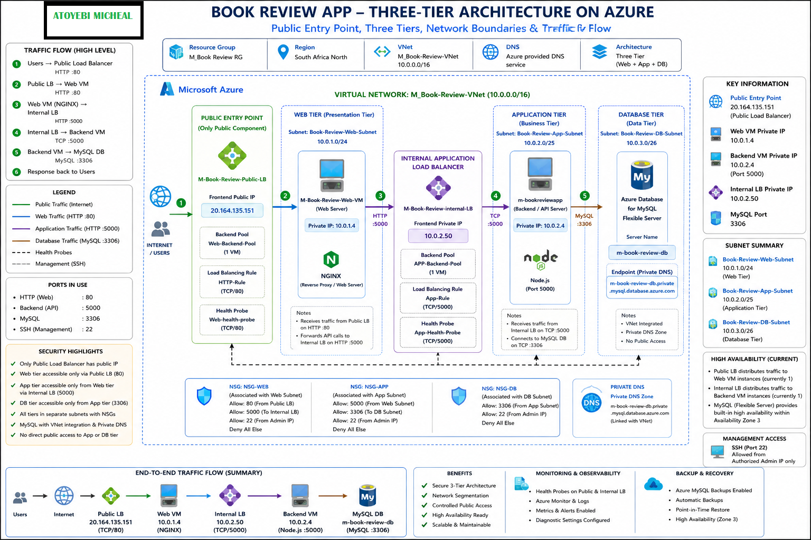

---

#### Screenshot 2 — Written architecture assumptions and selected Azure services

**Architecture Assumptions**

The Book Review App is deployed in South Africa North using a three-tier architecture that separates the Web, Application, and Database layers.

The solution is built within M_Book-Review-VNet, using the address space 10.0.0.0/16. Each application tier has its own subnet to provide network segmentation:

Web Tier: Book-Review-Web-Subnet — 10.0.1.0/24
Application Tier: Book-Review-App-Subnet — 10.0.2.0/25
Database Tier: Book-Review-DB-Subnet — 10.0.3.0/26

The Public Load Balancer (M-Book-Review-Public-LB) provides the application's public entry point through 20.164.135.151. Traffic is forwarded to the Web VM, M-Book-Review-Web-VM, which uses private IP 10.0.1.4 and NGINX to serve the frontend and proxy API requests.

API traffic is forwarded from NGINX to the Internal Load Balancer (M-Book-Review-internal-LB) at 10.0.2.50:5000. The internal load balancer forwards requests to the Node.js backend running on m-bookreviewapp, with private IP 10.0.2.4.

The backend connects to Azure Database for MySQL Flexible Server (m-book-review-db) over TCP port 3306. The database is integrated with the VNet and uses Private DNS for private name resolution.

Sensitive application configuration is managed using Azure Key Vault (M-bookreview-kv). Network Security Groups and health probes are used to control traffic and verify service availability.

The intended application traffic flow is:

Internet → Public Load Balancer → Web Tier → Internal Load Balancer → Application Tier → Database Tier

This design keeps the application and database communication on private network paths while providing a controlled public entry point.

**Selected Azure Services**

The deployment uses Azure Virtual Network for network isolation, Azure Virtual Machines for the Web and Application tiers, Azure Load Balancer for public and internal traffic management, and Azure Database for MySQL Flexible Server for the managed database tier.

NGINX is used as the Web-tier server and reverse proxy, while Node.js provides the application/API runtime.

Azure Key Vault is used for secret management, Private DNS provides private database name resolution, and Network Security Groups enforce traffic restrictions between the network tiers. Azure Load Balancer health probes provide backend health verification.

Architecture Summary

The deployment separates presentation, business logic, and data responsibilities while controlling communication between each tier.

Public Endpoint: 20.164.135.151

Web VM: 10.0.1.4

Internal Application Endpoint: 10.0.2.50:5000

Backend VM: 10.0.2.4:5000

Database: m-book-review-db — MySQL 3306

VNet: M_Book-Review-VNet — 10.0.0.0/16

---

# Task 2 — Create the Azure Network Foundation

## Goal

Create a dedicated Resource Group and VNet with separate subnets for the web, application, and database tiers, keeping the application and database tiers without direct public access.

### Evidence

#### Screenshot 3 — Resource Group overview showing the assignment resources

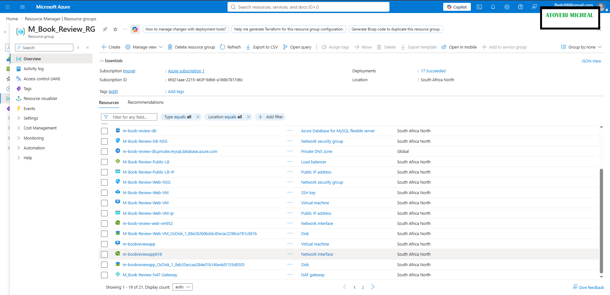

---

#### Screenshot 4 — VNet overview showing the address space and all required subnets

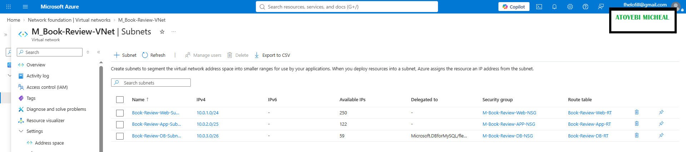

---

#### Screenshot 5 — Route-table or Private DNS evidence where applicable

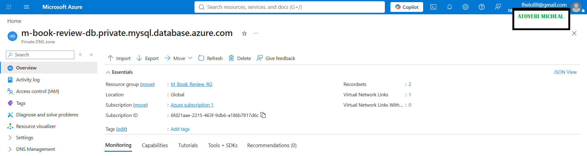

---

# Task 3 — Configure Security and Secret Management

## Goal

Apply least-privilege NSG rules so traffic flows Internet → public entry point → web tier → application tier → database tier, and store credentials in Azure Key Vault or another approved secure mechanism.

### Evidence

#### Screenshot 6 — NSG rules proving least-privilege access between the tiers

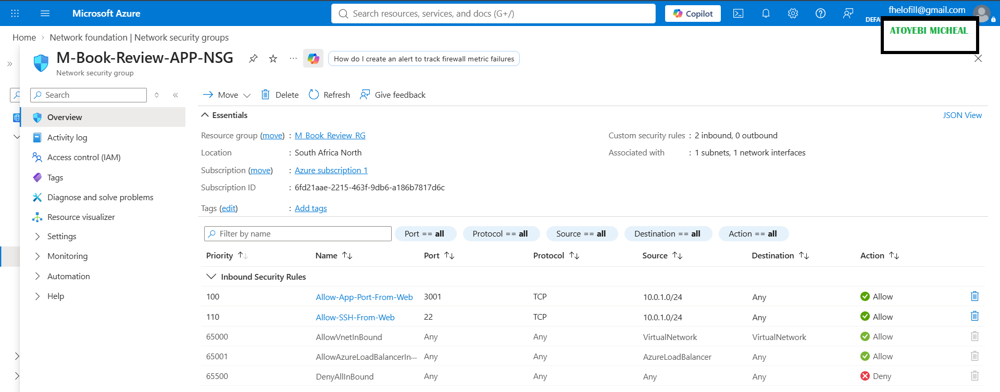

---

#### Screenshot 7 — Key Vault or approved secret-management configuration (without displaying secret values)

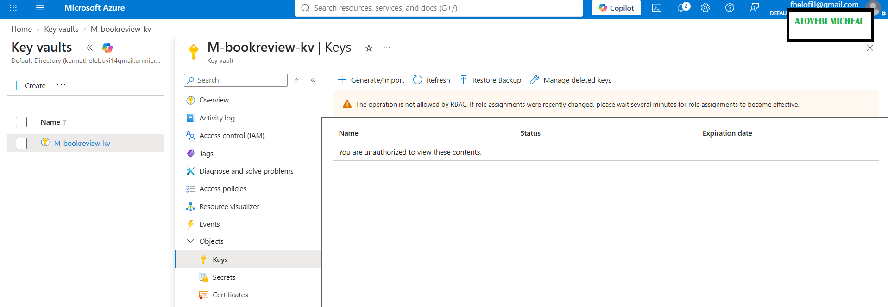

---

# Task 4 — Deploy the Presentation (Web) Tier

## Goal

Deploy the Book Review App presentation layer on the approved web-tier compute service, configured to route requests to the internal application-tier endpoint, and not directly exposed except through the public entry service.

### Evidence

#### Screenshot 8 — Web-tier compute overview showing subnet and availability configuration

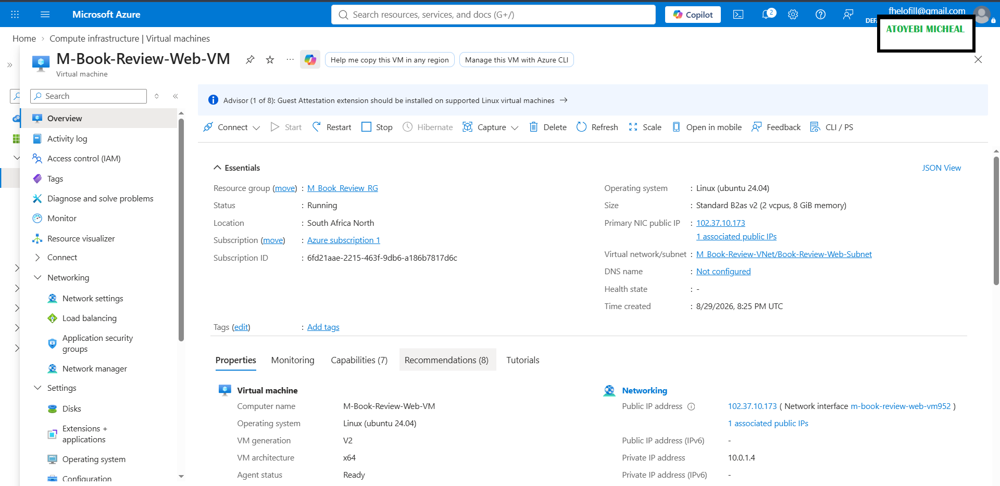

---

#### Screenshot 9 — Terminal or service output proving the presentation layer is running

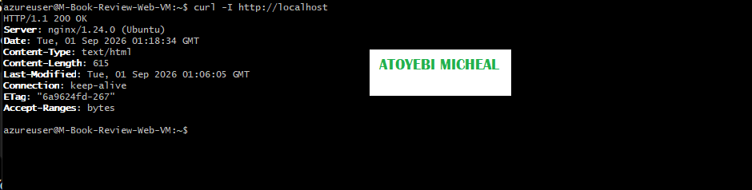

---

# Task 5 — Deploy the Business (Application) Tier

## Goal

Deploy the Book Review App backend privately in the application subnet, configured to use the private database endpoint and secured environment values, reachable only through its internal endpoint.

### Evidence

#### Screenshot 10 — Application-tier compute overview showing private subnet placement

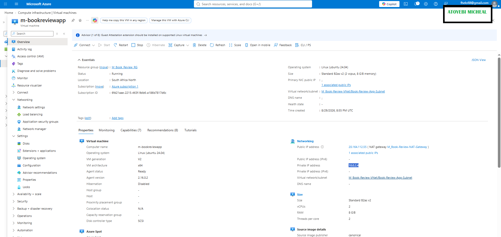

---

#### Screenshot 11 — Backend process, service, or listening-port evidence

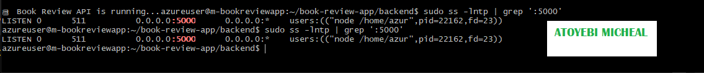

---

#### Screenshot 12 — Internal health-check or API response (without exposing secrets)

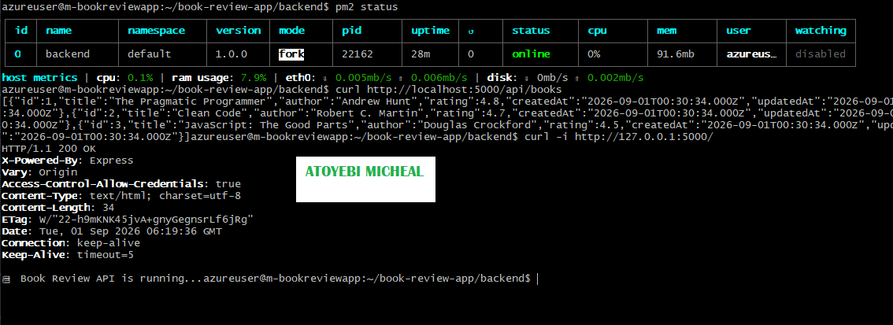

---

# Task 6 — Deploy the Managed Database Tier

## Goal

Create a private Azure managed database (public access disabled), with availability/backup/retention settings, the Book Review App schema imported, and access restricted to the application tier only.

### Evidence

#### Screenshot 13 — Database overview showing private connectivity and public access disabled

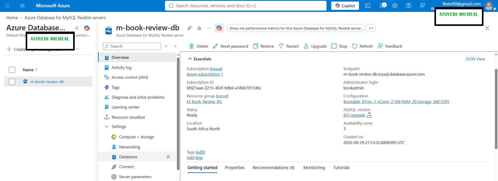

---

#### Screenshot 14 — Availability, backup, and retention configuration

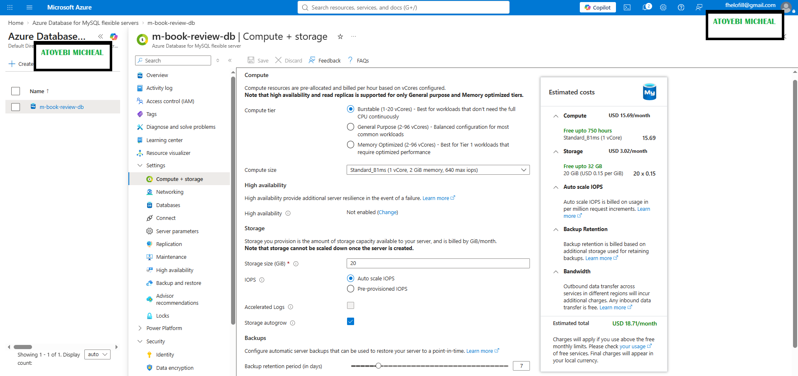

---

#### Screenshot 15 — Successful schema or connectivity verification (without exposing credentials)

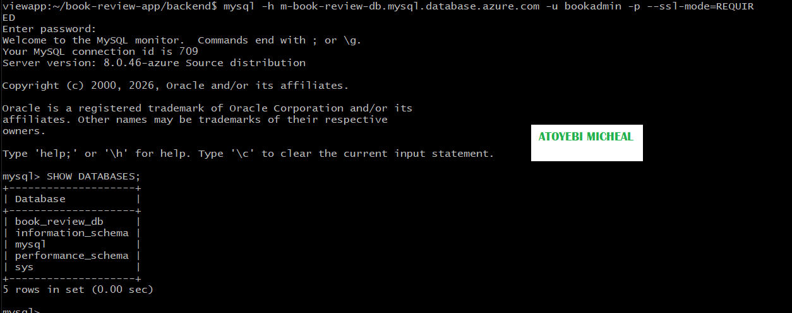

---

# Task 7 — Configure Traffic Management, Availability, and Monitoring

## Goal

Configure the approved public entry service with health probes and backend pools, internal routing for the application tier where required, and enable Azure Monitor/diagnostics/logs/alerts for the key resources.

### Evidence

#### Screenshot 16 — Public entry service showing listener, frontend endpoint, and healthy web targets

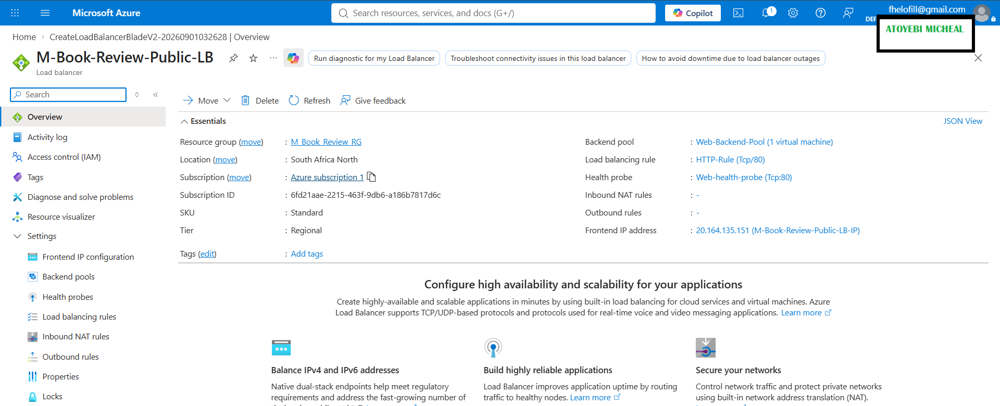
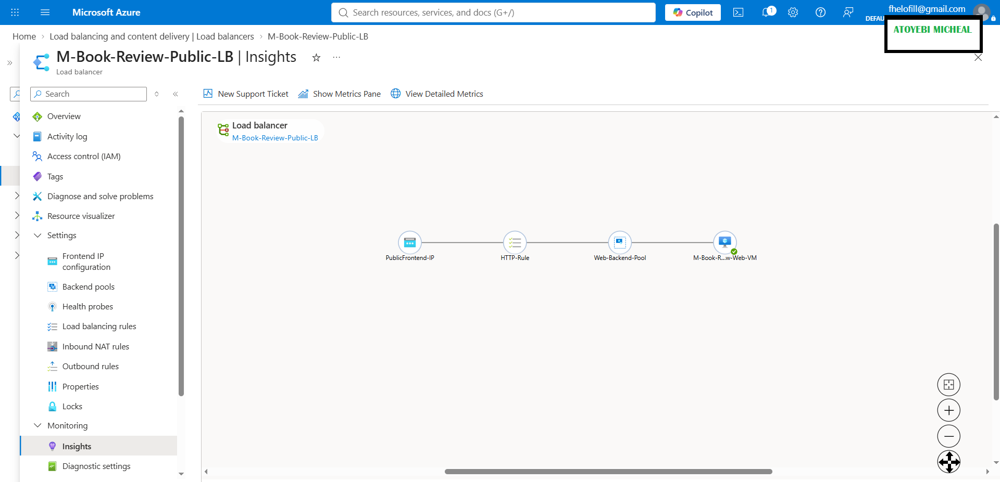

---

#### Screenshot 17 — Internal application-tier load-balancing or routing configuration where applicable

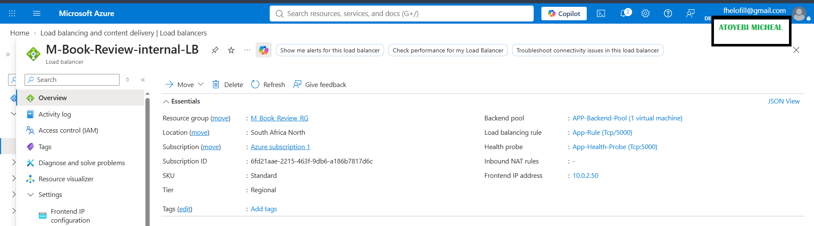

---

#### Screenshot 18 — Azure Monitor, diagnostic settings, logs, metrics, or alert evidence

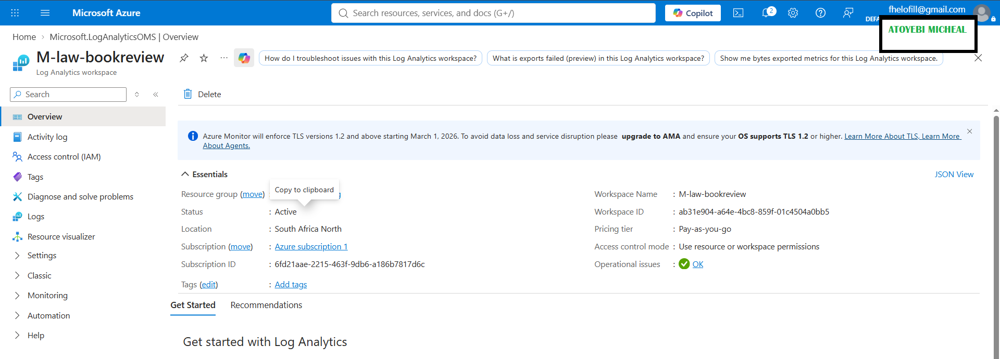

---

# Task 8 — Validate the Production-Style Deployment

## Goal

Confirm the Book Review App works end to end through the public endpoint, with at least one database read and one write, confirm private tiers are not internet-reachable, and complete a safe availability test.

### Evidence

#### Screenshot 19 — Browser showing the Book Review App through the public endpoint

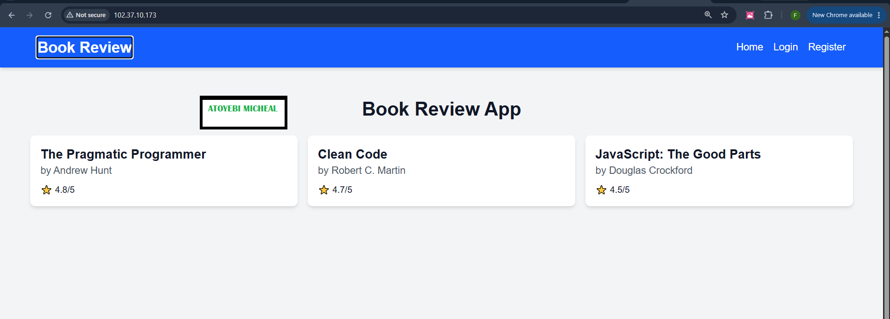

---

#### Screenshot 20 — Proof of successful database-backed read and write operations

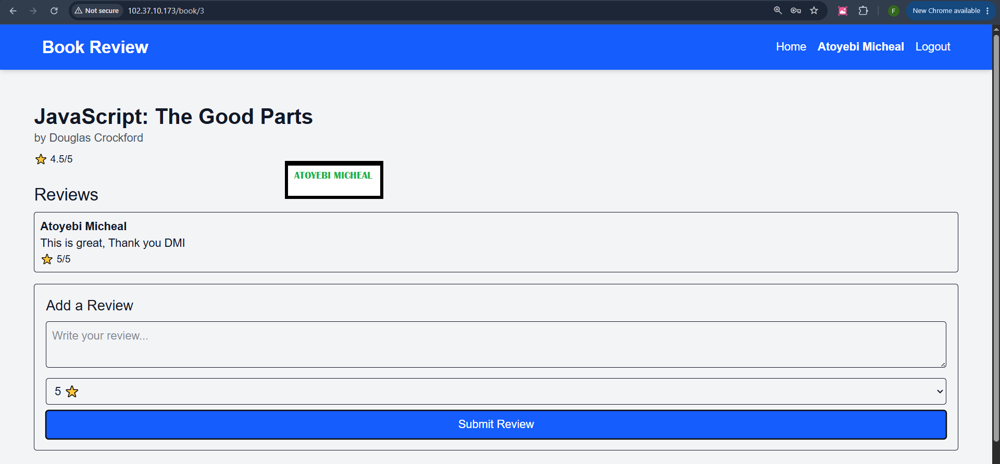

---

#### Screenshot 21 — Evidence that private tiers are not publicly accessible

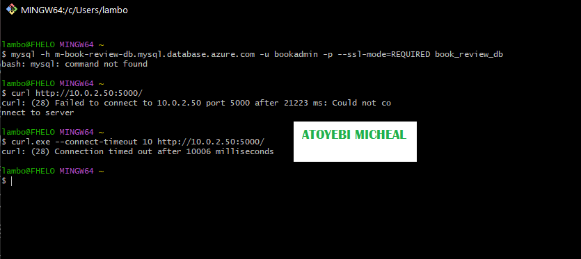

---

#### Screenshot 22 — Availability-test and healthy-target evidence

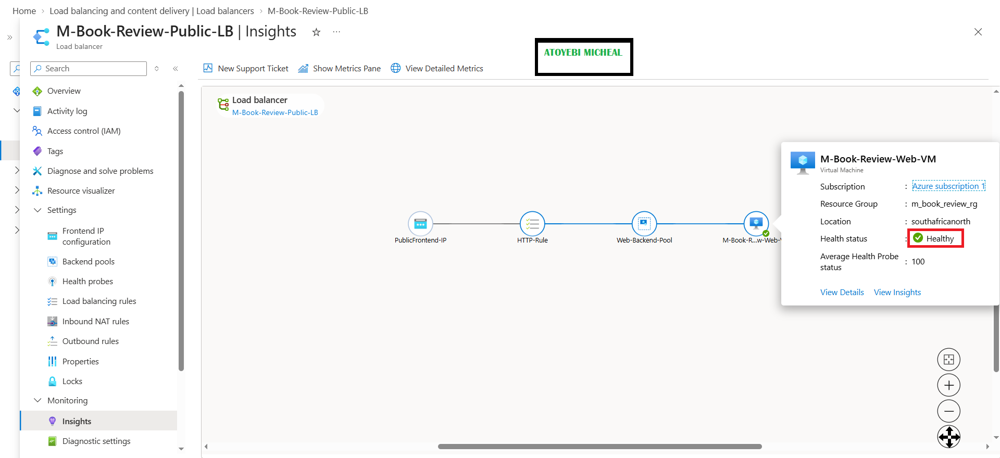
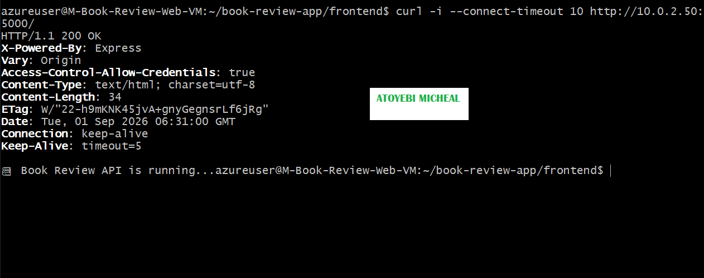
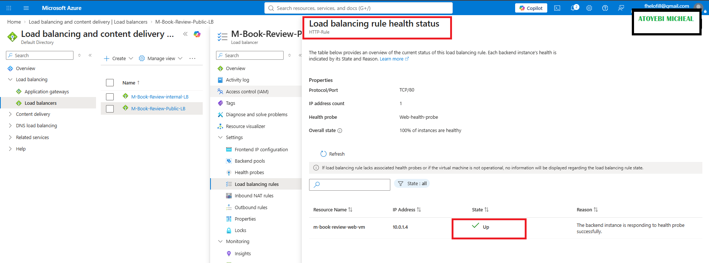

---

#### Public Endpoint

Paste your public endpoint URL here:

`http://20.164.135.151/`

---

### Notes

Summarize what worked, issues encountered and how they were fixed, and the availability/security/secrets/monitoring/backup choices made.

### Notes

The Book Review App was successfully deployed on Azure using a three-tier architecture consisting of separate Web, Application, and Database tiers. The Web tier uses NGINX and is accessed through the Azure Public Load Balancer, while application requests are forwarded through the internal load balancer to the private Node.js backend. The backend connects to Azure Database for MySQL through private networking.

During deployment, several issues were identified and resolved. These included backend port conflicts, incorrect backend routing, frontend API configuration issues, and excessive duplicate database indexes created by Sequelize schema synchronization. The database index issue was resolved by removing the unnecessary duplicate indexes while retaining the required unique email index. The backend was then configured to run consistently on port `5000`, and the NGINX reverse proxy was updated to route API requests through the internal application endpoint.

Security was implemented by separating the Web, Application, and Database tiers into dedicated subnets and restricting communication to the required ports. The application and database tiers use private network paths, while Azure Key Vault is used for secure management of application secrets. Public access is provided through the designated Public Load Balancer rather than exposing the backend service directly.

Availability and operational visibility were addressed using Azure Load Balancer health probes and Azure monitoring capabilities. The managed MySQL database provides Azure-managed backup and recovery capabilities, while the application architecture allows the individual tiers to be managed independently.

The final deployment was validated through the public application endpoint, including frontend access, API communication, database-backed read operations, and database-backed write operations. Private connectivity and service health were also verified during testing.

---

# Submission Instructions

- Add all required screenshots and links in your submission
- Do not expose passwords, keys, connection strings, or subscription IDs

---

# Completion Checklist

- [ ] Task 1: Architecture diagram and assumptions documented (Screenshots 1–2)
- [ ] Task 2: Network foundation created with isolated tiers (Screenshots 3–5)
- [ ] Task 3: Least-privilege security and secret management configured (Screenshots 6–7)
- [ ] Task 4: Presentation tier deployed (Screenshots 8–9)
- [ ] Task 5: Application tier deployed privately (Screenshots 10–12)
- [ ] Task 6: Managed database tier deployed privately (Screenshots 13–15)
- [ ] Task 7: Public entry, internal routing, and monitoring configured (Screenshots 16–18)
- [ ] Task 8: End-to-end validation and availability test completed (Screenshots 19–22, Public Endpoint, Notes)
- [ ] No sensitive data exposed

---

## 📌 About DMI & CloudAdvisory

DevOps Micro Internship (DMI) is a project-based DevOps program run by Pravin Mishra (The CloudAdvisory) focused on real-world execution, systems thinking, and career readiness.

It helps learners build strong DevOps foundations with hands-on experience.

---

## 📌 Resources

- 🌐 DMI Official Website: https://dmi.pravinmishra.com?utm_source=github&utm_medium=readme  
- 🎓 University: https://university.pravinmishra.com?utm_source=github&utm_medium=readme  
- 💬 Discord Community: https://discord.pravinmishra.com?utm_source=github&utm_medium=readme  
- 📝 Blog: https://dmi.pravinmishra.com/blog?utm_source=github&utm_medium=readme  
- ▶️ YouTube Playlist: https://www.youtube.com/playlist?list=PLFeSNDtI4Cho  
- 🔗 Pravin Mishra (LinkedIn): https://www.linkedin.com/in/pravin-mishra-aws-trainer/  
- 🏢 CloudAdvisory (LinkedIn): https://www.linkedin.com/company/thecloudadvisory/

---

*This submission is part of DevOps Micro Internship (DMI) Cohort 3 — Agentic AI Track.*
