# Assignment 04 — Deploy Mini Finance on Azure Using Terraform and Ansible

Part of the DevOps Micro Internship (DMI) with Agentic AI

---

## Purpose

In this assignment, you will provision Azure infrastructure using Terraform and deploy the Mini Finance website using an Ansible multi-play playbook.

Terraform will create the Azure Virtual Machine and networking resources. Ansible will install Nginx, clone the Mini Finance repository, deploy the website, and verify the deployment.

---

# Task 1 — Create the Project Structure

## Goal

Create separate directories and files for the Terraform infrastructure and Ansible configuration.

### Evidence

#### Screenshot 1 — Terminal or VS Code showing the complete `mini-finance` project structure

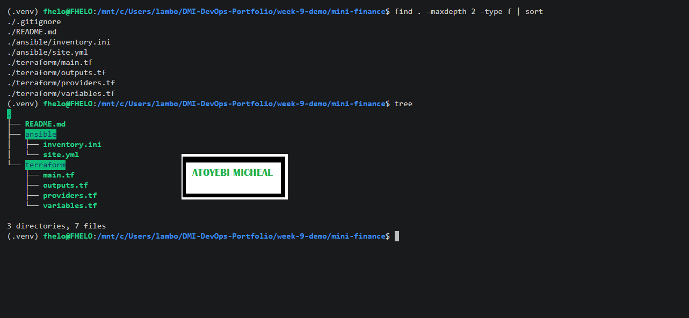

---

### Notes

### Notes

Created the Mini Finance project structure with separate Terraform and Ansible directories. Added the required Terraform files, Ansible files, README.md, and .gitignore. Verified the complete project structure using the find command. No additional resources or files were added beyond the assignment requirements.

---

# Task 2 — Create the Azure Infrastructure Using Terraform

## Goal

Use Terraform to provision an Ubuntu Virtual Machine with the required Azure networking and security resources.

### Evidence

#### Screenshot 2 — Terraform code showing the `Allow-SSH` rule for port `22` and the `Allow-HTTP` rule for port `80`

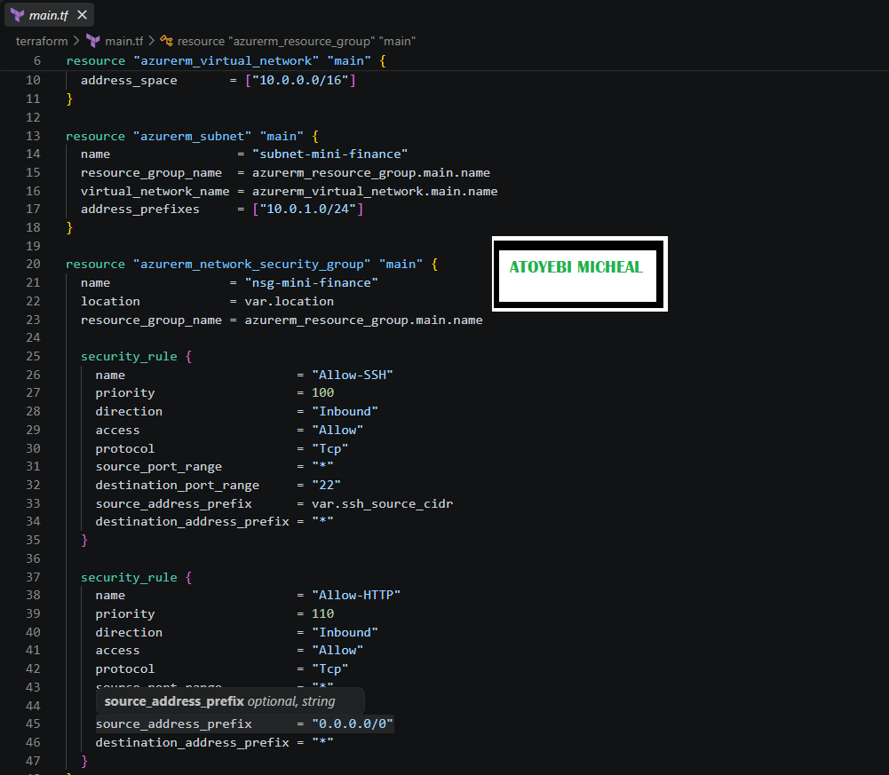

---

#### Screenshot 3 — Terraform code showing the association between `nsg-mini-finance` and `nic-mini-finance`

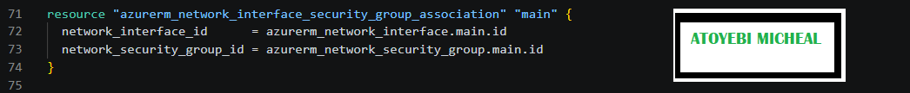

---

### Notes

### Notes

Configured the Azure infrastructure using Terraform for the Mini Finance deployment. Created the required Resource Group, Virtual Network, Subnet, Network Security Group, SSH and HTTP inbound rules, Standard Static Public IP, Network Interface, NSG-to-NIC association, and Ubuntu 22.04 Linux Virtual Machine. SSH access was restricted to the controller's public IP using /32, while HTTP access was allowed on port 80. Configured SSH key authentication with password authentication disabled and added the required public_ip Terraform output.

---

# Task 3 — Initialize and Apply the Terraform Configuration

## Goal

Format and validate the Terraform configuration, review the execution plan, and provision the Azure infrastructure.

### Evidence

#### Screenshot 4 — End of the `terraform apply` output showing `Apply complete!` with no errors

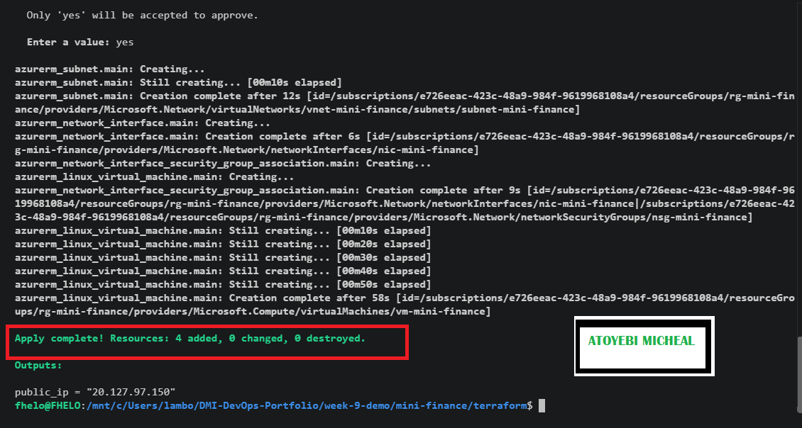

---

#### Screenshot 5 — Output of `terraform output public_ip` showing the VM’s public IP address

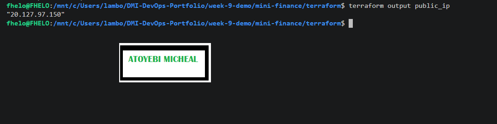

---

### Notes

Successfully provisioned the Mini Finance Azure infrastructure using Terraform. The deployment completed successfully with 4 resources added, 0 changed, and 0 destroyed. The Terraform output displayed the public IP address of the Azure VM for the next deployment steps.

---

# Task 4 — Verify Passwordless SSH Access

## Goal

Confirm that the Ansible controller can connect to the Terraform-provisioned Azure VM using SSH key authentication.

### Evidence

#### Screenshot 6 — Passwordless SSH command and the returned `mini-finance` hostname

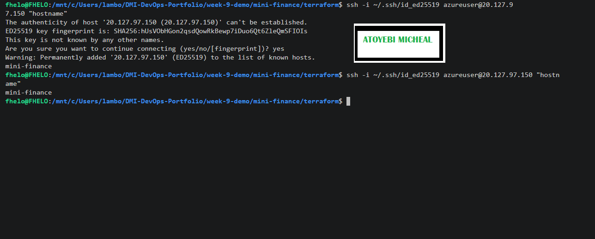

---

### Notes

Successfully verified passwordless SSH access to the Azure VM using the configured SSH private key. The connection was established without a password prompt, and the hostname returned was mini-finance, confirming successful access to the correct VM.

---

# Task 5 — Create the Ansible Inventory and Verify Connectivity

## Goal

Add the Terraform-provisioned Azure VM to the Ansible inventory and confirm that Ansible can connect to it.

### Evidence

#### Screenshot 7 — Ansible ping output showing `SUCCESS` and `pong` from the Azure VM

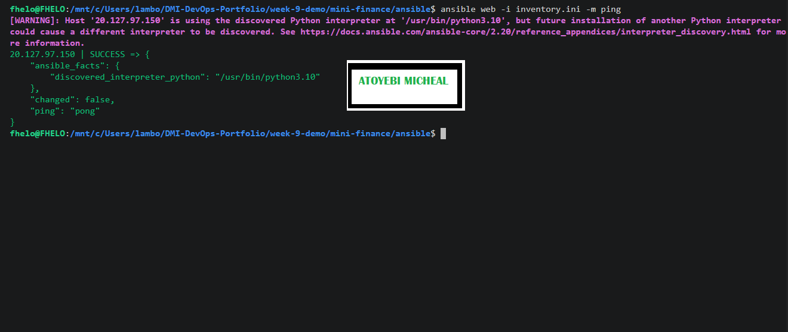

---

### Configuration File

Copy and paste the complete contents of your `ansible/inventory.ini` file below:

```ini
[web]
20.127.97.150

[web:vars]
ansible_user=azureuser
ansible_ssh_private_key_file=~/.ssh/id_ed25519
```

---

# Task 6 — Create the Multi-Play Ansible Playbook

## Goal

Create one Ansible playbook containing separate plays to install Nginx, deploy the Mini Finance website, and verify the deployment.

### Evidence

#### Screenshot 8 — `site.yml` showing Play 1 and the beginning of Play 2

Screenshot must show:

- Play 1 targeting the `web` group
- Installation of `nginx`, `git`, and `rsync`
- Nginx service configured as started and enabled
- Beginning of Play 2 with the Git repository URL and synchronization task

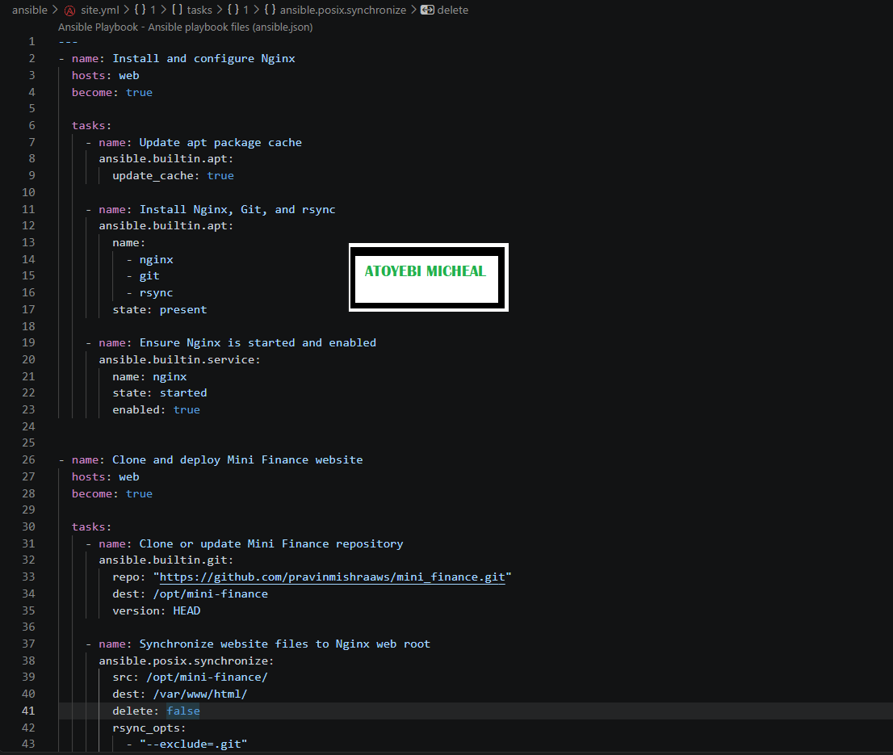

---

#### Screenshot 9 — `site.yml` showing the deployment destination, handler, and Play 3 verification

Screenshot must show:

- Website destination `/var/www/html/`
- Ownership set to `www-data:www-data`
- Nginx reload handler
- Play 3 targeting `localhost`
- The `uri` verification and `assert` condition

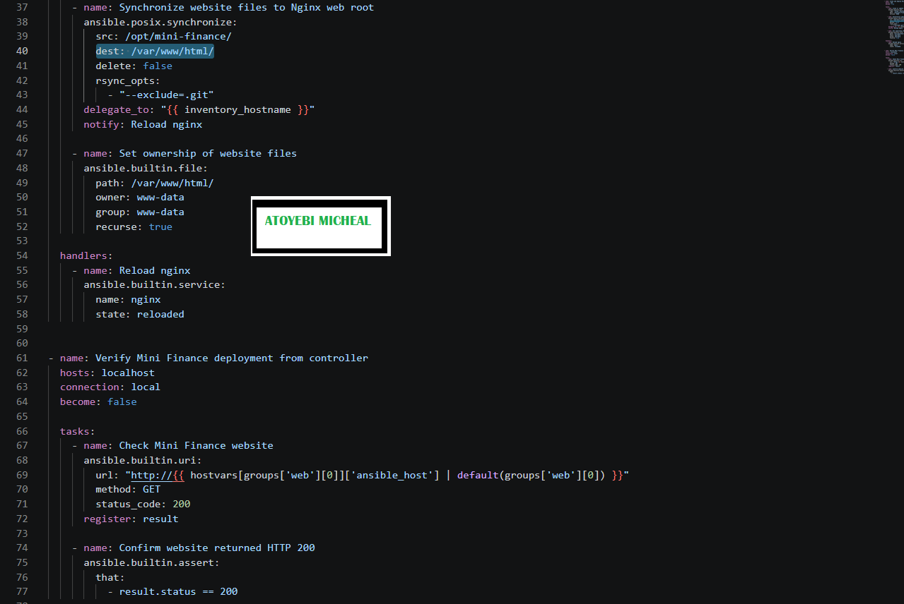

---

### Configuration File

Copy and paste the complete contents of your `ansible/site.yml` file below:

```yaml
---
- name: Install and configure Nginx
  hosts: web
  become: true

  tasks:
    - name: Update apt package cache
      ansible.builtin.apt:
        update_cache: true

    - name: Install Nginx, Git, and rsync
      ansible.builtin.apt:
        name:
          - nginx
          - git
          - rsync
        state: present

    - name: Ensure Nginx is started and enabled
      ansible.builtin.service:
        name: nginx
        state: started
        enabled: true


- name: Clone and deploy Mini Finance website
  hosts: web
  become: true

  tasks:
    - name: Clone or update Mini Finance repository
      ansible.builtin.git:
        repo: "https://github.com/pravinmishraaws/mini-finance-project"
        dest: /opt/mini-finance
        version: HEAD

    - name: Synchronize website files to Nginx web root
      ansible.posix.synchronize:
        src: /opt/mini-finance/
        dest: /var/www/html/
        delete: false
        rsync_opts:
          - "--exclude=.git"
      delegate_to: "{{ inventory_hostname }}"
      notify: Reload nginx

    - name: Set ownership of website files
      ansible.builtin.file:
        path: /var/www/html/
        owner: www-data
        group: www-data
        recurse: true

  handlers:
    - name: Reload nginx
      ansible.builtin.service:
        name: nginx
        state: reloaded


- name: Verify Mini Finance deployment from controller
  hosts: localhost
  connection: local
  become: false

  tasks:
    - name: Check Mini Finance website
      ansible.builtin.uri:
        url: "http://{{ hostvars[groups['web'][0]]['ansible_host'] | default(groups['web'][0]) }}"
        method: GET
        status_code: 200
      register: result

    - name: Confirm website returned HTTP 200
      ansible.builtin.assert:
        that:
          - result.status == 200
```

---

# Task 7 — Validate and Run the Ansible Playbook

## Goal

Validate the syntax of the multi-play Ansible playbook and run it to install Nginx, deploy the Mini Finance website, and verify the deployment.

### Evidence

#### Screenshot 10 — Successful playbook syntax check showing `playbook: site.yml`

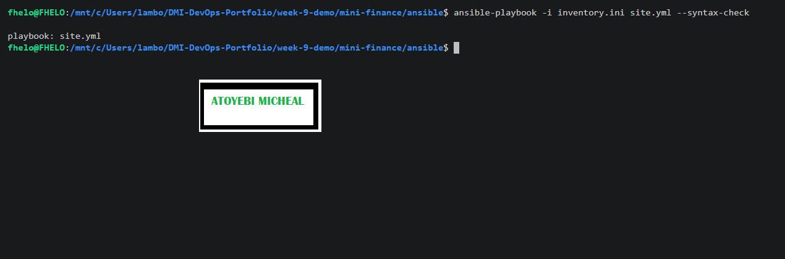

---

#### Screenshot 11 — Play 3 output showing the successful HTTP verification and assertion

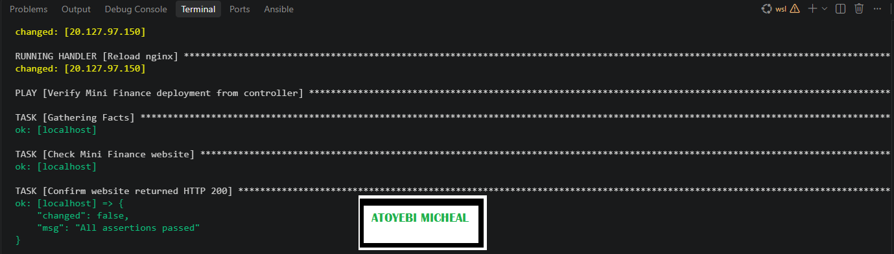

---

#### Screenshot 12 — Final `PLAY RECAP` showing `failed=0` and `unreachable=0`

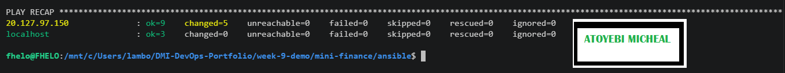

---

### Notes

Successfully executed the Ansible playbook to deploy and verify the Mini Finance website. The playbook completed successfully with Nginx configured, the website deployed, and HTTP verification returning status 200. The final play recap showed 0 unreachable hosts and 0 failed tasks, confirming a successful deployment.

---

# Task 8 — Test the Mini Finance Website in a Browser

## Goal

Confirm that the Mini Finance website is publicly accessible through the Azure VM’s public IP address.

### Evidence

#### Screenshot 13 — Mini Finance website successfully loading in the browser, with the Azure VM’s public IP address visible in the address bar

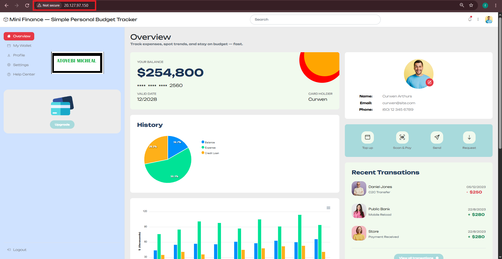

---

### Website URL

Add your deployed website URL below:

```text
http://20.127.97.150
```

---

# Task 9 — Create the Project README

## Goal

Create a `README.md` file to document the Mini Finance infrastructure and deployment project.

### Evidence

#### Screenshot 14 — Completed `README.md` displayed in the VS Code Markdown preview or terminal

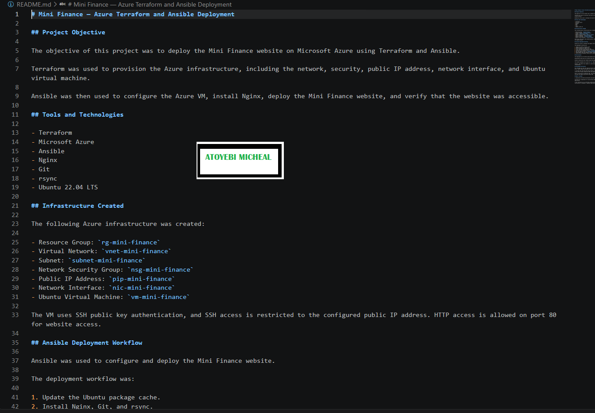

---

### README Content

Copy and paste the complete contents of your `README.md` file below:

```markdown
# Mini Finance — Azure Terraform and Ansible Deployment

## Project Objective

The objective of this project was to deploy the Mini Finance website on Microsoft Azure using Terraform and Ansible.

Terraform was used to provision the Azure infrastructure, including the network, security, public IP address, network interface, and Ubuntu virtual machine.

Ansible was then used to configure the Azure VM, install Nginx, deploy the Mini Finance website, and verify that the website was accessible.

## Tools and Technologies

- Terraform
- Microsoft Azure
- Ansible
- Nginx
- Git
- rsync
- Ubuntu 22.04 LTS

## Infrastructure Created

The following Azure infrastructure was created:

- Resource Group: `rg-mini-finance`
- Virtual Network: `vnet-mini-finance`
- Subnet: `subnet-mini-finance`
- Network Security Group: `nsg-mini-finance`
- Public IP Address: `pip-mini-finance`
- Network Interface: `nic-mini-finance`
- Ubuntu Virtual Machine: `vm-mini-finance`

The VM uses SSH public key authentication, and SSH access is restricted to the configured public IP address. HTTP access is allowed on port 80 for website access.

## Ansible Deployment Workflow

Ansible was used to configure and deploy the Mini Finance website.

The deployment workflow was:

1. Update the Ubuntu package cache.
2. Install Nginx, Git, and rsync.
3. Start and enable the Nginx service.
4. Clone the Mini Finance website repository.
5. Synchronize the website files to `/var/www/html/`.
6. Set the website files to `www-data:www-data` ownership.
7. Reload Nginx when the website content changes.
8. Verify that the website returns HTTP status code 200.

## Verification

The deployment was verified using Ansible and a web browser.

Passwordless SSH access was tested using the configured SSH private key, and the VM returned the hostname `mini-finance`.

Ansible connectivity was tested using the ping module, which returned `SUCCESS` and `pong`.

The Ansible playbook also used the `uri` module to request the website and confirm that it returned HTTP status 200.

Finally, the website was opened in a web browser using the Azure VM public IP address to confirm that the Mini Finance website was accessible through Nginx.

## Challenge and Solution

One challenge was that the repository URL initially specified for the website deployment was not available. The GitHub repository returned a 404 error, which caused the Ansible Git task to remain waiting.

I verified that the Azure VM could connect to GitHub and confirmed that DNS and general GitHub connectivity were working. I then identified the correct Mini Finance repository URL and updated the Ansible playbook.

After correcting the repository URL, the Ansible playbook successfully cloned the repository, deployed the website files, reloaded Nginx, and verified the website with HTTP status 200.

## What I Learned

I learned how Terraform and Ansible can work together in a DevOps workflow.

Terraform was responsible for provisioning the Azure infrastructure, while Ansible was responsible for configuring the server and deploying the application.

I also learned how to use SSH key authentication, Ansible inventories, multi-play Ansible playbooks, Nginx, Git, rsync, handlers, and HTTP verification to automate a complete application deployment.

```

---

# LinkedIn Post Required

## Evidence

#### Screenshot 15 — Published LinkedIn post showing the text and at least one deployment screenshot

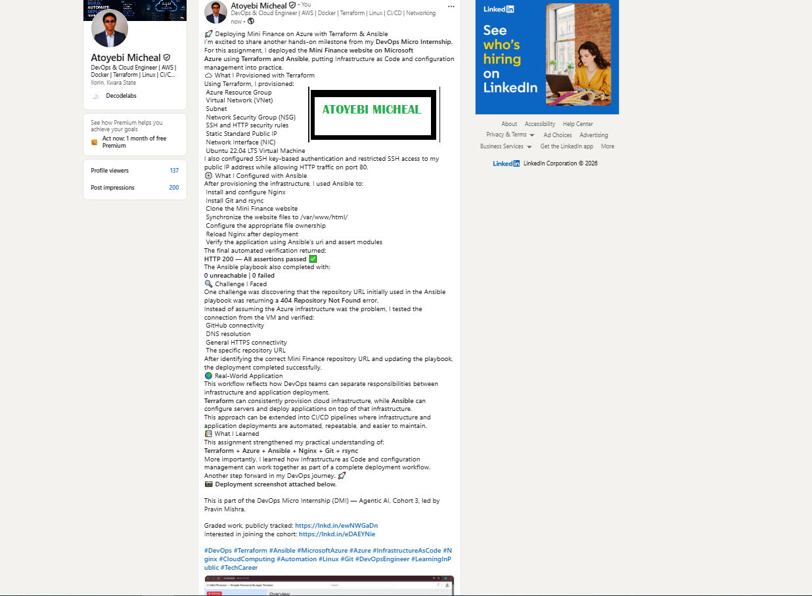

---

#### LinkedIn Post URL

Paste your LinkedIn post URL here:

`https://www.linkedin.com/feed/update/urn:li:activity:7508688332214669312/`

---

### LinkedIn Submission Notes

**One challenge you faced and how you fixed it:**

One challenge was discovering that the repository URL initially used in the Ansible playbook was returning a 404 Repository Not Found error.
Instead of assuming the Azure infrastructure was the problem, I tested the connection from the VM and verified:
 GitHub connectivity
 DNS resolution
 General HTTPS connectivity
 The specific repository URL
After identifying the correct Mini Finance repository URL and updating the playbook, the deployment completed successfully.

---

**One real-world example where you can use this learning:**

This workflow reflects how DevOps teams can separate responsibilities between infrastructure and application deployment.
Terraform can consistently provision cloud infrastructure, while Ansible can configure servers and deploy applications on top of that infrastructure.
This approach can be extended into CI/CD pipelines where infrastructure and application deployments are automated, repeatable, and easier to maintain.

---

# Assignment Questions

Answer the following in your own words:

**1. What did you provision using Terraform in this assignment?**

I used Terraform to provision the Azure infrastructure for the Mini Finance application. This included the Resource Group, Virtual Network, Subnet, Network Security Group, SSH and HTTP security rules, Static Public IP address, Network Interface, and Ubuntu 22.04 Virtual Machine.

---

**2. What did Ansible configure and deploy in this assignment?**

Ansible configured the Azure VM by installing and starting Nginx, Git, and rsync. It then cloned the Mini Finance website repository, synchronized the website files to /var/www/html/, set the correct file ownership, reloaded Nginx, and verified that the website was working.

---

**3. Why is SSH access on port `22` restricted to your public IP address?**

SSH is used to remotely connect to and manage the server. Restricting port 22 to my public IP address prevents unrestricted SSH access from the internet and reduces the number of systems that can attempt to connect to the server.

---

**4. Why is HTTP port `80` open to the internet?**

Port 80 is open because the Mini Finance website needs to be accessible through a web browser. Allowing HTTP traffic from the internet makes it possible for users to access the website using the VM's public IP address.

---

**5. What is the purpose of the Ansible inventory file?**

The Ansible inventory file tells Ansible which servers to manage and how to connect to them. In this assignment, it contains the Azure VM's public IP address, the azureuser username, and the SSH private key used to connect to the VM.

---

**6. Why does the playbook use separate plays for install, deploy, and verify?**

The playbook uses separate plays to keep the different stages of the deployment organized. One play installs and configures Nginx, another deploys the Mini Finance website, and the final play verifies that the website is responding correctly. This makes the automation easier to understand, manage, and troubleshoot.

---

**7. Why is `rsync` useful when deploying website files?**

rsync is useful because it can efficiently synchronize website files from the source directory to the Nginx web root. It helps transfer the required files while avoiding unnecessary copying of files that have not changed.

---

**8. What does the Ansible `uri` module verify in this assignment?**

The uri module sends an HTTP request to the Mini Finance website and checks the response. In this assignment, it verifies that the website returns HTTP status code 200, confirming that the deployed website is accessible.

---

**9. What issue did you face during this assignment, and how did you fix it?**

I initially had a problem with the repository URL used in the Ansible playbook. The original URL returned a 404 Repository Not Found error, even though the Azure VM could successfully connect to GitHub. I tested GitHub connectivity and DNS resolution, identified the correct Mini Finance repository URL, updated the Ansible playbook, and ran it again. After the correction, the repository cloned successfully and the website deployment completed successfully.

---

**10. What did you learn from using Terraform and Ansible together?**

I learned how Terraform and Ansible can work together in a DevOps deployment workflow. Terraform was used to provision the Azure infrastructure, while Ansible was used to configure the server and deploy the application. This showed me how infrastructure provisioning and application configuration can be separated into automated and repeatable steps.

---

# Required Files

Confirm that the following files are included in your assignment folder:

- [ ] `.gitignore`
- [ ] `README.md`
- [ ] `terraform/providers.tf`
- [ ] `terraform/main.tf`
- [ ] `terraform/variables.tf`
- [ ] `terraform/outputs.tf`
- [ ] `ansible/inventory.ini`
- [ ] `ansible/site.yml`

---

# Submission Instructions

- Add all required screenshots in the correct order.
- Full Name must be visible in required screenshots.
- Add the Azure VM public IP address.
- Add the final Mini Finance website URL.
- Paste `inventory.ini`, `site.yml`, and `README.md` as editable text.
- Answer all assignment questions clearly in your own words.
- Add your LinkedIn post URL.
- Do not expose SSH private keys, passwords, Azure credentials, subscription IDs, Terraform state contents, or other sensitive information.

---

# Completion Checklist

- [ ] Task 1: `mini-finance` project structure created
- [ ] Task 1: `.gitignore` created
- [ ] Task 2: Terraform Azure infrastructure code created
- [ ] Task 2: `Allow-SSH` rule configured for port `22`
- [ ] Task 2: `Allow-HTTP` rule configured for port `80`
- [ ] Task 2: NSG associated with the Network Interface
- [ ] Task 3: `terraform fmt` completed
- [ ] Task 3: `terraform init` completed
- [ ] Task 3: `terraform validate` completed successfully
- [ ] Task 3: `terraform apply` completed successfully
- [ ] Task 3: `terraform output public_ip` displayed the VM public IP
- [ ] Task 4: Passwordless SSH works from the Ansible controller
- [ ] Task 5: `inventory.ini` created
- [ ] Task 5: Ansible ping returns `SUCCESS` and `pong`
- [ ] Task 6: `site.yml` contains three separate plays
- [ ] Task 6: Play 1 installs Nginx, Git, and rsync
- [ ] Task 6: Play 2 clones and deploys the Mini Finance website
- [ ] Task 6: Play 3 verifies HTTP status code `200`
- [ ] Task 7: Playbook syntax check passes
- [ ] Task 7: Ansible playbook completes successfully
- [ ] Task 7: Final recap shows `failed=0` and `unreachable=0`
- [ ] Task 8: Mini Finance website loads in the browser
- [ ] Task 8: Azure VM public IP is visible in the browser screenshot
- [ ] Task 9: `README.md` completed
- [ ] Screenshots 1–15 are included
- [ ] `inventory.ini`, `site.yml`, and `README.md` are pasted as editable text
- [ ] Assignment questions are answered
- [ ] LinkedIn post published with Anyone visibility
- [ ] LinkedIn post URL added
- [ ] No sensitive information is exposed

---

## About DMI & CloudAdvisory

DevOps Micro Internship (DMI) is a project-based DevOps program run by Pravin Mishra and The CloudAdvisory, focused on real-world execution, systems thinking, and career readiness.

It helps learners build strong DevOps foundations with hands-on experience.

---

## Resources

- DMI Official Website: [https://dmi.pravinmishra.com?utm_source=github&utm_medium=readme](https://dmi.pravinmishra.com?utm_source=github&utm_medium=readme)
- University: [https://university.pravinmishra.com?utm_source=github&utm_medium=readme](https://university.pravinmishra.com?utm_source=github&utm_medium=readme)
- Discord Community: [https://discord.pravinmishra.com?utm_source=github&utm_medium=readme](https://discord.pravinmishra.com?utm_source=github&utm_medium=readme)
- Blog: [https://dmi.pravinmishra.com/blog?utm_source=github&utm_medium=readme](https://dmi.pravinmishra.com/blog?utm_source=github&utm_medium=readme)
- YouTube Playlist: [https://www.youtube.com/playlist?list=PLFeSNDtI4Cho](https://www.youtube.com/playlist?list=PLFeSNDtI4Cho)
- Pravin Mishra LinkedIn: [https://www.linkedin.com/in/pravin-mishra-aws-trainer/](https://www.linkedin.com/in/pravin-mishra-aws-trainer/)
- CloudAdvisory LinkedIn: [https://www.linkedin.com/company/thecloudadvisory/](https://www.linkedin.com/company/thecloudadvisory/)

---

*This submission is part of DevOps Micro Internship (DMI) — Agentic AI Track.*